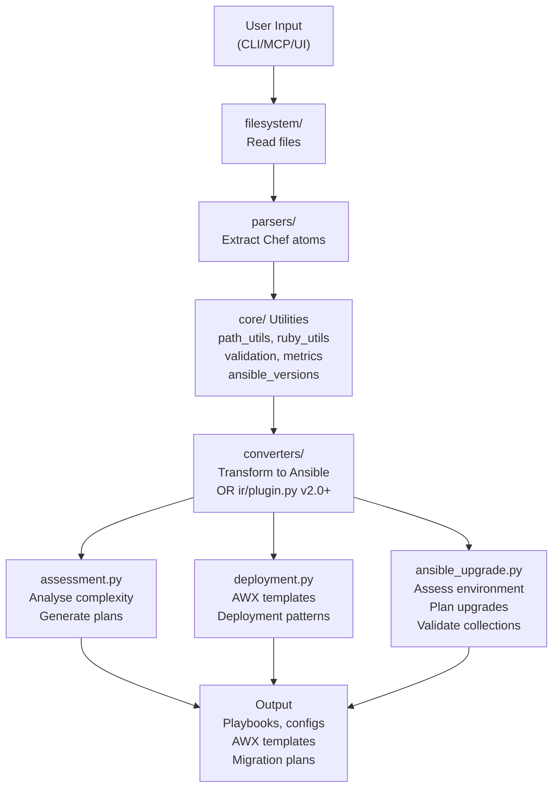

# SousChef Architecture Guide

This document explains the structure of SousChef, where code belongs, and the reasoning behind architectural decisions.

## Quick Navigation

- [Overall Structure](#overall-structure)
- [Module Responsibilities](#module-responsibilities)
- [Where Code Goes](#where-code-goes)
- [Design Patterns](#design-patterns)
- [Adding New Features](#adding-new-features)
- [Common Scenarios](#common-scenarios)

## Overall Structure

```
souschef/
├── __init__.py              # Package initialization
├── server.py                # MCP server entry point & tool registration
├── cli.py                   # Command-line interface
├── assessment.py            # Migration assessment and planning
├── deployment.py            # AWX/AAP integration & deployment strategies
├── ansible_upgrade.py       # Ansible upgrade planning and assessment
│
├── ir/                      # Intermediate Representation (v2.0)
│   ├── __init__.py          # Package exports
│   ├── schema.py            # Core IR data structures and graph
│   ├── versioning.py        # Version management and schema evolution
│   └── plugin.py            # Plugin architecture for parsers/generators
│
├── core/                    # Shared utilities (no business logic)
│   ├── __init__.py
│   ├── ansible_versions.py  # Ansible version compatibility data
│   ├── constants.py         # Shared constants and configuration
│   ├── errors.py            # Error handling utilities
│   ├── metrics.py           # Effort/timeline metrics calculations
│   ├── path_utils.py        # Path normalization and safety checks
│   ├── ruby_utils.py        # Ruby value parsing and normalization
│   └── validation.py        # General validation utilities
│
├── parsers/                 # Chef artifact parsing (read-only)
│   ├── __init__.py
│   ├── ansible_inventory.py # Parse Ansible environments and inventory
│   ├── attributes.py        # Parse Chef attributes files
│   ├── habitat.py           # Parse Habitat plan files
│   ├── inspec.py            # Parse InSpec profiles
│   ├── metadata.py          # Parse cookbook metadata.rb
│   ├── recipe.py            # Parse Chef recipes
│   ├── resource.py          # Parse custom resource definitions
│   └── template.py          # Parse ERB templates
│
├── converters/              # Chef to Ansible conversion
│   ├── __init__.py
│   ├── habitat.py           # Habitat → Docker conversion
│   ├── playbook.py          # Recipe → Ansible playbook
│   └── resource.py          # Resource → Ansible task
│
├── ui/                      # Streamlit web interface
│   ├── app.py               # Main dashboard and routing
│   ├── pages/               # Streamlit pages
│   │   ├── ai_settings.py
│   │   ├── cookbook_analysis.py
│   │   └── validation_reports.py
│   └── health_check.py      # Health check endpoint
│
└── filesystem/              # Filesystem operations
    └── operations.py        # Directory/file operations with validation
```

### Top-Level Files

| File | Purpose | When to Edit |
|------|---------|--------------|
| `server.py` | MCP tool registration & entry point | Adding new MCP tools, tool parameter changes |
| `cli.py` | Command-line commands | Adding CLI subcommands, CLI-specific options |
| `assessment.py` | Migration assessment logic | Adding assessment methods, complexity rules |
| `deployment.py` | AWX integration & deployment patterns | Deployment strategies, platform-specific logic |
| `ansible_upgrade.py` | Ansible upgrade planning logic | Adding upgrade planning features, new upgrade workflows |

## Module Dependencies

The data flows through SousChef modules in this pattern:



**Key principle**: Each layer specialises in one concern:
- `parsers/` = extract only (read-only)
- `converters/` = transform only  
- `core/` = utilities only
- Top-level files (`assessment.py`, `deployment.py`, `ansible_upgrade.py`) = orchestrate
- `server.py`, `cli.py`, `ui/` = expose via different interfaces

## Intermediate Representation (IR) Module - v2.0

The `ir/` module (introduced in v2.0) provides a unified, abstract representation of infrastructure configurations from various source tools (Chef, Puppet, Salt, Bash, PowerShell) that can be converted to target systems (Ansible, Terraform, CloudFormation).

### IR Module Structure

| Module | Purpose |
|--------|---------|
| `schema.py` | Core data structures: IRNode, IRGraph, IRAction, IRAttribute, IRGuard |
| `versioning.py` | Version management, compatibility checking, and schema migrations |
| `plugin.py` | Plugin architecture: SourceParser, TargetGenerator, PluginRegistry |

### Key Concepts

**IRGraph**: A directed acyclic graph (DAG) representation of infrastructure where:
- Nodes represent configurable entities (recipes, resources, handlers)
- Edges represent dependencies between nodes
- Attributes and actions describe node properties and operations
- Metadata tracks source file and location information

**Plugin Architecture**:
- `SourceParser`: Abstract base for parsers (Chef, Puppet, etc. → IR)
- `TargetGenerator`: Abstract base for generators (IR → Ansible, Terraform, etc.)
- `PluginRegistry`: Central registry managing parser and generator lifecycle

**Versioning**:
- Semantic versioning (major.minor.patch) for IR schema
- Version compatibility checking (major version must match)
- Schema migration support for evolving IR format

### Relationship to Other Modules

```
parsers/ (v1.0)
   ↓ (extracts raw structures)
ir/schema.py (normalised representation)
   ↓ (applies transformations)
converters/ (v1.0) or ir/plugin.py (v2.0)
   ↓
Target format (Ansible, Terraform, etc.)
```

### When to Use IR vs Converters

**Use IR module (`ir/plugin.py`) for:**
- New parsers/generators requiring plugin architecture
- Cross-tool compatibility checking
- Version management and schema evolution
- Extensible framework for multiple source/target combinations

**Use converters module (`converters/`) for:**
- Direct Chef → Ansible transformations (v1.0 compatibility)
- Specific format conversions (Habitat → Docker)
- Legacy code requiring minimal refactoring

### Implementation Guide

For detailed IR module documentation including API reference, examples, and best practices, see [IR.md](IR.md).

## Module Responsibilities

### `core/` - Shared Utilities

**Purpose**: No business logic. Only utilities that multiple modules need.

**What Goes Here**:
- Constants and configuration values
- Data validation functions
- Error handling and formatting
- Path utilities with security checks
- Ruby/Chef value parsing
- Metrics calculations
- Version compatibility data (Ansible-Python matrices)

**What Does NOT Go Here**:
- Migration planning logic → `assessment.py`
- Recipe parsing → `parsers/recipe.py`
- Playbook generation → `converters/playbook.py`
- Ansible upgrade planning → `ansible_upgrade.py`

**Modules**:
- `constants.py` - Shared constants and configuration
- `errors.py` - Error handling utilities
- `metrics.py` - Effort and timeline calculations
- `path_utils.py` - Path normalisation and safety checks
- `ruby_utils.py` - Ruby value parsing and normalisation
- `validation.py` - General validation utilities
- `ansible_versions.py` - Ansible and Python version compatibility matrices

**`ansible_versions.py` Module**

Centralises Ansible-Python version compatibility data and upgrade path calculations. Consumed by `ansible_upgrade.py` and related assessment tools.

**Responsibilities**:
- Maintain version compatibility matrices (Ansible Core vs Python versions)
- Track end-of-life dates for each version
- Calculate safe upgrade paths between versions
- Identify breaking changes and required actions

**What It Provides**:
- `ANSIBLE_VERSIONS` dictionary: Version metadata (release date, EOL, Python support, breaking changes)
- `UpgradePath` dataclass: Upgrade sequence, effort estimation, risk assessment
- `get_python_compatibility()`: Retrieve compatible Python versions for a given Ansible version
- `calculate_upgrade_path()`: Determine safe migration path between versions
- `get_eol_status()`: Check if version is end-of-life or approaching EOL

For detailed API reference, data structures, and version matrices, see [ANSIBLE_UPGRADE_INTEGRATION.md](ANSIBLE_UPGRADE_INTEGRATION.md#Module-Responsibilities).

**Example**:
```python
# [YES] Belongs in core/
# - Shared constants
# - Path normalisation
# - Error formatting
# - Version matrices
HOURS_PER_WORKDAY = 8  # core/metrics.py
METADATA_FILENAME = "metadata.rb"  # core/constants.py
ANSIBLE_VERSIONS = {...}  # core/ansible_versions.py

# [YES] Belongs in core/ansible_versions.py
def get_python_compatibility(ansible_version: str) -> List[str]:
    """Get compatible Python versions for Ansible version."""
    return ANSIBLE_VERSIONS[ansible_version].python_versions

def calculate_upgrade_path(from_version: str, to_version: str) -> dict:
    """Calculate safe upgrade path between versions."""
    # Uses ANSIBLE_VERSIONS data

# [NO] Does NOT belong in core/
# - "assess complexity of this cookbook" logic
# - "convert this recipe to playbook" logic
# - "generate upgrade plan" logic
```

### `parsers/` - Chef and Ansible Artifact Parsing

**Purpose**: Extract structure from Chef and Ansible files (read-only, no transformation).

**Principles**:
- Only **read** and **parse** artifacts
- Extract raw data structures without modification
- No domain-specific interpretation
- No conversion between formats (Chef ↔ Ansible)

**What Goes Here**:
- Recipe resource extraction
- Attribute file parsing
- Metadata parsing
- Template structure analysis
- Custom resource definition parsing
- Ansible environment and inventory parsing
- Ansible configuration parsing

**What Does NOT Go Here**:
- Complexity scoring → `assessment.py`
- Ansible conversion → `converters/`
- Migration planning → `assessment.py`
- Upgrade planning → `ansible_upgrade.py`

**Modules**:
- `recipe.py` - Extract resources from Chef recipes
- `attributes.py` - Parse Chef attribute files
- `metadata.py` - Parse cookbook metadata.rb
- `template.py` - Parse ERB templates
- `resource.py` - Parse custom resource definitions
- `habitat.py` - Parse Habitat plan files
- `inspec.py` - Parse InSpec profiles
- `ansible_inventory.py` - Parse Ansible inventory files and environments (NEW)

**Example**:
```python
# [YES] Belongs in parsers/recipe.py
def parse_recipe(recipe_path: str) -> dict:
    """Extract resources from a Chef recipe (parse only)."""
    resources = []
    # Read file, extract resources
    return {"resources": resources}

# [YES] Belongs in parsers/ansible_inventory.py
def parse_inventory_ini(inventory_path: str) -> dict:
    """Parse Ansible inventory file in INI format."""
    groups = {}
    # Read file, extract groups and hosts
    return {"groups": groups}

# [NO] Does NOT belong in parsers/
def assess_recipe_complexity(recipe_path):
    """This is assessment logic, not parsing."""
    # Belongs in assessment.py
```

### `converters/` - Chef to Ansible Transformation

**Purpose**: Convert parsed Chef structures to Ansible format.

**Principles**:
- Takes output from `parsers/` as input
- Produces Ansible-compatible output
- No further parsing of input
- Focused on one transformation type

**Organization**:
- `playbook.py` - Recipe → Playbook conversion
- `resource.py` - Resource → Ansible task conversion
- `habitat.py` - Habitat → Docker conversion

**What Goes Here**:
- Chef resource to Ansible module mapping
- Recipe to playbook generation
- Template conversion (ERB → Jinja2)
- Habitat to Docker/Compose conversion

**What Does NOT Go Here**:
- Parsing Chef files → `parsers/`
- Assessment logic → `assessment.py`
- File I/O → `filesystem/`

**Example**:
```python
# [YES] Belongs in converters/resource.py
def convert_resource_to_task(resource_dict):
    """Convert a parsed Chef resource to Ansible task."""
    return {
        "name": resource_dict["type"],
        "ansible.builtin.debug": {"msg": "..."}
    }

# [NO] Does NOT belong in converters/
def parse_recipe_for_resources():
    """This is parsing, not conversion."""
    # Belongs in parsers/recipe.py
```

### `assessment.py` - Migration Assessment

**Purpose**: High-level migration planning and assessment logic.

**Responsibilities**:
- Analyze cookbook complexity
- Generate migration recommendations
- Create migration roadmaps
- Estimate effort and timeline
- Assess deployment strategies
- Analyze cookbook dependencies

**What Goes Here**:
- Complexity scoring algorithms
- Effort estimation
- Recommendation generation
- Migration planning logic
- Dependency analysis

**What Does NOT Go Here**:
- Parsing Chef files → `parsers/`
- Converting to Ansible → `converters/`
- File operations → `filesystem/`

**Example**:
```python
# [YES] Belongs in assessment.py
def assess_single_cookbook(cookbook_path):
    """Assess complexity and generate recommendations."""
    metrics = count_artifacts(cookbook_path)
    complexity = calculate_complexity(metrics)
    return {
        "complexity": complexity,
        "estimated_effort_days": estimate_effort(complexity)
    }

# Uses parsers to get raw data
# Uses converters to show playbook output
# Does not do the parsing or converting itself
```

### `deployment.py` - AWX/AAP & Deployment

**Purpose**: Deployment strategies, AWX integration, platform-specific logic.

**Responsibilities**:
- AWX/AAP project and credential generation
- Deployment strategy selection (blue-green, canary, rolling)
- Platform-specific configurations
- Deployment risk assessment
- Resource requirement estimation

**What Goes Here**:
- AWX project generation
- Deployment strategy logic
- Platform detection and adaptation
- Resource estimation for deployments

**What Does NOT Go Here**:
- General migration assessment → `assessment.py`
- Recipe parsing → `parsers/`
- Playbook generation → `converters/`

### `ansible_upgrade.py` - Ansible Upgrade Planning

**Purpose**: Ansible version upgrade assessment, planning, and validation logic.

**Responsibilities**:
- Detect Python and Ansible versions in environments
- Assess Ansible environment configuration
- Generate detailed upgrade plans with risk assessment
- Validate collection compatibility against target versions
- Generate upgrade testing plans
- Identify breaking changes and required actions

**What Goes Here**:
- Ansible environment assessment logic
- Upgrade path calculation
- Collection compatibility validation
- Risk assessment for upgrades
- Testing plan generation
- Breaking change identification

**What Does NOT Go Here**:
- Version compatibility data → `core/ansible_versions.py`
- Ansible environment parsing → `parsers/ansible_inventory.py`
- Chef migration logic → `assessment.py`

**Dependencies**:
- `core/ansible_versions.py` - Version compatibility matrices
- `parsers/ansible_inventory.py` - Parse and detect Ansible versions

**Example**:
```python
# [YES] Belongs in ansible_upgrade.py
def generate_upgrade_plan(current_version, target_version):
    """Generate upgrade plan using version data and environment parsing."""
    versions = get_supported_versions()  # From core/ansible_versions
    env = assess_ansible_environment(env_path)  # Parse environment
    return {
        "upgrade_path": calculate_upgrade_path(current_version, target_version),
        "pre_upgrade_checklist": generate_checklist(current_version),
        "upgrade_steps": generate_steps(versions),
        # ... etc
    }

# Uses core/ansible_versions for data
# Uses parsers/ansible_inventory for environment info
# Combines them for upgrade planning
```

### `server.py` - MCP Tool Registration

**Purpose**: Single entry point for all MCP tools.

**Key Principles**:

1. **Register All Tools Here**
   - Every MCP tool gets `@mcp.tool()` decorator in `server.py`
   - Imports the actual implementation from specialized modules

2. **Keep Tightly-Coupled Tools Together**
   - If multiple tools share significant context, keep in `server.py`
   - Example: databag and environment functions (1,180 lines) share credential handling

3. **Extract When Reusable or Isolatable**
   - If a tool is standalone or reusable, move to appropriate module
   - Example: `assess_single_cookbook` → `assessment.py`

4. **Backward Compatibility Exports**
   - Re-export internal functions for test imports
   - Mark with `# noqa: F401` (intentional unused imports)
   - Don't remove these imports!

**Example**:
```python
# In server.py
@mcp.tool()
def assess_chef_migration_complexity(cookbook_paths: str) -> str:
    """MCP tool wrapper."""
    return _assess_chef_migration_complexity(cookbook_paths)

# Actual implementation in assessment.py
def _assess_chef_migration_complexity(cookbook_paths: str) -> str:
    """Internal implementation."""
    # Logic here
```

### `filesystem/` - Filesystem Operations

**Purpose**: Safe file operations with validation.

**Principles**:
- All file operations go through `filesystem.operations`
- Validates paths to prevent directory traversal
- Handles archive extraction safely
- Consistent error handling

**What Goes Here**:
- Directory/file operations
- Archive extraction and creation
- Path validation
- File permission checks

**What Does NOT Go Here**:
- Path utilities → `core/path_utils.py`
- Application logic → other modules

### `cli.py` - Command-Line Interface

**Purpose**: CLI commands for direct tool invocation.

**Principles**:
- Wraps functions from other modules
- Handles CLI-specific formatting
- Click-based command definitions
- Output formatting for terminals

**Example**:
```python
# [YES] Belongs in cli.py
@cli.command()
@click.argument("cookbook_path", type=str)
def assess_cookbook(cookbook_path):
    """CLI command."""
    from souschef.assessment import assess_single_cookbook
    result = assess_single_cookbook(cookbook_path)
    click.echo(result)
```

### `ui/` - Streamlit Web Interface

**Purpose**: Web-based interface for interactive workflows.

**Organization**:
- `app.py` - Main dashboard and routing
- `pages/` - Individual page components
- `health_check.py` - Health check endpoint

**Principles**:
- Calls functions from core modules
- Handles UI-specific formatting
- Session state management
- Page routing

## Where Code Goes

### Decision Tree

```
I'm adding a new feature. Where does it go?

1. Is it about parsing Chef files?
   YES → parsers/
   NO → go to 2

2. Is it about converting to Ansible?
   YES → converters/
   NO → go to 3

3. Is it about migration assessment/planning?
   YES → assessment.py
   NO → go to 4

4. Is it about deployments/AWX integration?
   YES → deployment.py
   NO → go to 5

5. Is it a shared utility (not business logic)?
   YES → core/
   NO → go to 6

6. Is it a CLI command?
   YES → cli.py
   NO → go to 7

7. Is it a web UI component?
   YES → ui/
   NO → go to 8

8. Is it file operations?
   YES → filesystem/
   NO → go to 9

9. Is it an MCP tool or server config?
   YES → server.py
   NO → Needs new module (discuss first)
```

### Examples

**"I need to parse Chef Berkshelf files"**
1. Create `parsers/berkshelf.py`
2. Implement `parse_berkshelf(file_path) -> dict`
3. Add tests in `tests/unit/test_server.py` (unit) and `tests/integration/test_integration.py`
4. Export from `server.py` if it's an MCP tool

**"I need to score complexity differently"**
1. Update complexity function in `assessment.py`
2. Or create `core/complexity_calculator.py` if it's reusable
3. Update tests in `tests/unit/test_server.py`
4. Update documentation

**"I need to support a new deployment strategy"**
1. Add to `deployment.py`
2. Implement strategy logic
3. Add tests in `tests/integration/test_integration.py`
4. Register MCP tool in `server.py` if user-facing

**"I need a new CLI command"**
1. Add command in `cli.py`
2. Call existing function from appropriate module
3. Add tests in `tests/unit/test_server.py`

## Design Patterns

### Pattern 1: Layered Approach

```
┌─────────────────────────────────┐
│  MCP Server / CLI / Web UI      │  server.py, cli.py, ui/
│  (User Interface)                │
├─────────────────────────────────┤
│  Assessment / Deployment Logic   │  assessment.py, deployment.py
│  (Domain Logic)                  │
├─────────────────────────────────┤
│  Converters                      │  converters/
│  (Transformation)                │
├─────────────────────────────────┤
│  Parsers                         │  parsers/
│  (Data Extraction)               │
├─────────────────────────────────┤
│  Utilities                       │  core/, filesystem/
│  (Shared Infrastructure)         │
└─────────────────────────────────┘
```

**Flow**: UI calls → Domain Logic → Transformers → Parsers → Utilities

### Pattern 2: Separation of Concerns

| Concern | Module(s) | Responsibility |
|---------|-----------|-----------------|
| **Parsing** | `parsers/` | Read and extract |
| **Converting** | `converters/` | Transform format |
| **Assessment** | `assessment.py` | Analyze and plan |
| **Deployment** | `deployment.py` | Execute and monitor |
| **CLI** | `cli.py` | Command handling |
| **Web UI** | `ui/` | Web presentation |
| **Utilities** | `core/`, `filesystem/` | Shared services |

### Pattern 3: Mock Patching

When testing, **patch where functions are used**, not where they're defined.

**Example**:
```python
# Function defined in: souschef/parsers/recipe.py
def parse_recipe(path: str) -> dict:
    ...

# Function used in: souschef/assessment.py
def assess_cookbook(path: str) -> dict:
    recipe_data = parse_recipe(path)  # Uses it here
    ...

# Test in: tests/unit/test_server.py
def test_assess_cookbook():
    with patch("souschef.assessment.parse_recipe") as mock:
        # Patch where it's USED, not where it's defined
        mock.return_value = {"resources": []}
        result = assess_cookbook("/path/to/cookbook")
        assert result["complexity"] == "Low"
```

### Pattern 4: Backward Compatibility

Re-export internal functions from `server.py` for test imports:

```python
# In souschef/assessment.py
def _assess_complexity(path: str) -> str:
    """Internal function."""

# In souschef/server.py
from souschef.assessment import _assess_complexity  # noqa: F401

# In tests/unit/test_server.py
from souschef.server import _assess_complexity
```

**Why?**
- Tests import from single entry point (`server.py`)
- Internal refactoring doesn't break test imports
- `# noqa: F401` suppresses "unused import" warning

## Adding New Features

### Checklist

- [ ] Determined correct module (use decision tree above)
- [ ] Created/updated file in appropriate location
- [ ] Added type hints to all functions
- [ ] Added docstrings (Google style)
- [ ] Wrote unit tests in `tests/unit/test_server.py`
- [ ] Wrote integration tests in `tests/integration/test_integration.py`
- [ ] Added property-based tests if applicable
- [ ] Ran `poetry run ruff check .` and `poetry run ruff format .`
- [ ] Ran `poetry run mypy souschef`
- [ ] Ran `poetry run pytest --cov=souschef`
- [ ] Updated documentation if needed
- [ ] Updated CONTRIBUTING.md if adding new tool type

### Example: Adding Chef Berkshelf Support

**Step 1**: Create the parser
```python
# souschef/parsers/berkshelf.py
def parse_berkshelf(file_path: str) -> dict:
    """Parse Berkshelf file and extract cookbook sources.

    Args:
        file_path: Path to Berkshelf file

    Returns:
        Dictionary with cookbook sources and versions
    """
```

**Step 2**: Create tests
```python
# tests/unit/test_server.py (unit)
def test_parse_berkshelf_success():
    """Test parsing valid Berkshelf file."""
    with patch("souschef.parsers.berkshelf.Path.read_text") as mock:
        mock.return_value = "cookbook 'nginx', '~> 5.0'"
        result = parse_berkshelf("/path/to/Berksfile")
        assert "nginx" in result["sources"]

# tests/integration/test_integration.py (integration)
def test_parse_real_berkshelf_file():
    """Test with actual Berkshelf file."""
    fixture_path = FIXTURES_DIR / "Berksfile"
    result = parse_berkshelf(str(fixture_path))
    assert isinstance(result, dict)
```

**Step 3**: Register MCP tool
```python
# souschef/server.py
@mcp.tool()
def parse_berkshelf_file(file_path: str) -> str:
    """Parse Berkshelf file and list dependencies."""
    from souschef.parsers.berkshelf import parse_berkshelf
    result = parse_berkshelf(file_path)
    return json.dumps(result, indent=2)
```

**Step 4**: Document
- Update README.md with new capability
- Add example to user guide
- Update CONTRIBUTING.md if it's a new parser type

## Common Scenarios

### Scenario 1: "Complexity scoring gives wrong results"

**Where to look**:
1. `assessment.py` - Scoring algorithms
2. `core/metrics.py` - Metric calculations
3. `parsers/` - Data extraction (might be missing something)

**What to check**:
- Unit tests in `tests/unit/test_server.py`
- Integration tests in `tests/integration/test_integration.py`
- Complexity thresholds in `core/constants.py`

### Scenario 2: "Recipe parsing misses a resource type"

**Where to look**:
1. `parsers/recipe.py` - Resource extraction logic
2. `core/constants.py` - Resource type mappings

**What to check**:
- Unit tests for the resource type
- Integration tests with real cookbooks
- Regex patterns for resource detection

### Scenario 3: "Generated playbook is incorrect"

**Where to look**:
1. `converters/playbook.py` - Playbook generation
2. `parsers/recipe.py` - Input data (might be wrong)
3. `converters/resource.py` - Resource conversion

**What to check**:
- Unit tests for each resource type conversion
- Integration tests with various cookbook patterns

### Scenario 4: "CLI command doesn't work"

**Where to look**:
1. `cli.py` - Command definition
2. Underlying module (`assessment.py`, `parsers/`, etc.)
3. `core/` - Utilities and error handling

**What to check**:
- CLI tests in `tests/unit/test_server.py`
- Error handling in underlying module
- Argument validation

### Scenario 5: "Web UI shows wrong data"

**Where to look**:
1. `ui/pages/*.py` - UI component
2. `ui/app.py` - Data flow/state management
3. Underlying module that provides data

**What to check**:
- Session state management
- Data transformation for display
- Underlying data source

## Guidelines for New Modules

If you think you need a **new module**, follow this checklist:

- [ ] Not a "grab-bag" (has clear, cohesive purpose)
- [ ] At least 3-5 related functions
- [ ] Reusable by multiple other modules OR
- [ ] Distinct responsibility that warrants isolation
- [ ] Has associated tests
- [ ] Documented in this architecture guide

**Example Good New Module**: `core/complexity_calculator.py`
- Clear purpose (calculate complexity)
- 3+ functions (score resources, analyze patterns, recommend strategies)
- Reusable by multiple modules
- Testable in isolation

**Example Not-Ready-Yet**: Single utility function
- Too small for its own module
- Should go in appropriate existing module or `core/utils.py`

## Related Documentation

- **CONTRIBUTING.md** - Development workflow and standards
- **Code Standards** - Linting, type hints, docstrings
- **Testing Guide** - Test structure and patterns
- **GitHub Copilot Instructions** - IDE setup and configuration

---

**Questions?** Check CONTRIBUTING.md or open a GitHub discussion!
