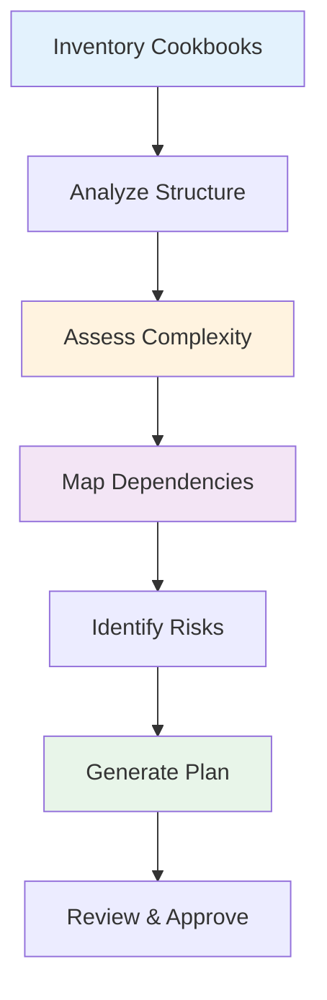
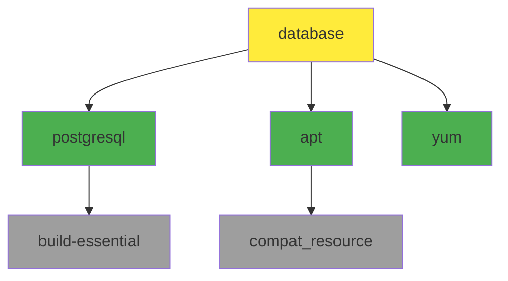
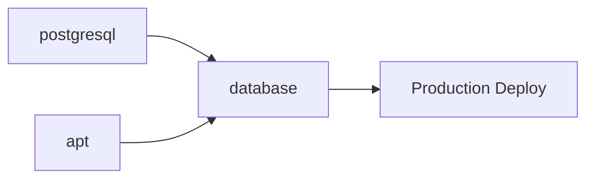

# Migration Assessment

Comprehensive guidance on assessing Chef cookbook complexity, analyzing dependencies, and creating data-driven migration plans.

## Assessment Overview

Assessment is the foundation of successful migration. SousChef provides automated tools to evaluate complexity, identify risks, and generate actionable migration plans.

!!! quote "Measure Twice, Migrate Once"
    Thorough assessment prevents surprises, reduces rework, and ensures realistic timelines. Invest time upfront to save effort later.

---

## Assessment Process



---

## Step 1: Inventory Cookbooks

### Catalog All Cookbooks

First, identify all cookbooks in your Chef infrastructure.

**Using SousChef CLI:**

```bash
# List all cookbooks in directory
find /path/to/cookbooks -name "metadata.rb" -exec dirname {} \;

# For each cookbook, extract basic info
for cookbook in cookbooks/*; do
  echo "=== $(basename $cookbook) ==="
  souschef-cli metadata "$cookbook/metadata.rb"
  echo ""
done > cookbook_inventory.txt
```

**Using MCP (AI Assistant):**

```
List all cookbooks in /path/to/cookbooks and show me their
metadata including versions, dependencies, and supported platforms
```

### Inventory Checklist

Create a spreadsheet or document with:

- [ ] Cookbook name and version
- [ ] Maintainer/owner
- [ ] Dependencies (direct and transitive)
- [ ] Number of recipes
- [ ] Number of custom resources
- [ ] Number of templates
- [ ] Supported platforms
- [ ] Data bag usage
- [ ] Chef search usage
- [ ] InSpec profiles (if any)
- [ ] Habitat plans (if any)

---

## Step 2: Analyze Cookbook Structure

### Automated Structure Analysis

Use SousChef to analyze each cookbook's structure:

=== "MCP (AI Assistant)"
    ```
    Analyze the structure of cookbook at /path/to/cookbook
    and show me the file counts and organization
    ```

=== "CLI"
    ```bash
    souschef-cli structure /path/to/cookbook

    # Or for all cookbooks
    for cookbook in cookbooks/*; do
      echo "=== $(basename $cookbook) ==="
      souschef-cli structure "$cookbook"
    done > cookbook_structures.txt
    ```

**Example Output:**

```
database/
├── metadata.rb
├── README.md
├── attributes/
│   ├── default.rb
│   └── production.rb
├── recipes/
│   ├── default.rb
│   ├── install.rb
│   ├── configure.rb
│   └── backup.rb
├── templates/
│   └── default/
│       ├── postgresql.conf.erb
│       └── pg_hba.conf.erb
├── resources/
│   ├── database.rb
│   └── user.rb
├── libraries/
│   └── helpers.rb
└── test/
    └── integration/
        └── default/
            └── default_test.rb

Summary:
  Recipes: 4
  Attributes: 2
  Templates: 2
  Custom Resources: 2
  Libraries: 1
  Tests: 1
```

### Structure Complexity Indicators

| Indicator | Low | Medium | High |
|-----------|-----|--------|------|
| Recipes | 1-3 | 4-10 | 11+ |
| Custom Resources | 0-1 | 2-4 | 5+ |
| Templates | 0-3 | 4-8 | 9+ |
| Attributes Files | 1 | 2-3 | 4+ |
| Libraries | 0 | 1-2 | 3+ |
| Lines of Code | <300 | 300-1000 | 1000+ |

---

## Step 3: Assess Complexity & Effort

### Automated Complexity Assessment

SousChef's complexity assessment tool analyzes multiple dimensions and provides dual effort estimates:

=== "MCP (AI Assistant)"
    ```
    Assess the migration complexity for cookbook at /path/to/cookbook
    including dependency analysis
    ```

=== "CLI"
    ```bash
    # Single cookbook
    souschef-cli assess /path/to/cookbook --include-dependencies

    # All cookbooks
    souschef-cli assess /path/to/cookbooks --recursive --output assessment_report.json
    ```

**Assessment Output:**

```json
{
  "cookbook": "database",
  "version": "2.1.0",
  "complexity_score": 6.5,
  "complexity_level": "Medium",

  "effort_estimates": {
    "manual_effort_days": 5,
    "manual_effort_hours": 40,
    "with_souschef_days": 2.5,
    "with_souschef_hours": 20,
    "time_saved_days": 2.5,
    "time_saved_hours": 20,
    "efficiency_gain_percent": 50
  },

  "metrics": {
    "recipes": {
      "count": 4,
      "total_resources": 23,
      "avg_resources_per_recipe": 5.75,
      "complexity": "Medium"
    },
    "custom_resources": {
      "count": 2,
      "total_properties": 8,
      "total_actions": 5,
      "complexity": "Low"
    },
    "templates": {
      "count": 2,
      "total_variables": 12,
      "erb_complexity": "Low"
    },
    "attributes": {
      "count": 15,
      "precedence_levels_used": 2,
      "complexity": "Low"
    },
    "dependencies": {
      "direct": 3,
      "transitive": 7,
      "complexity": "Medium"
    },
    "data_bags": {
      "referenced": 1,
      "complexity": "Low"
    },
    "search_queries": {
      "count": 0,
      "complexity": "None"
    }
  },

  "risk_factors": [
    {
      "type": "dependency_chain",
      "severity": "Medium",
      "description": "7 transitive dependencies require migration first",
      "mitigation": "Migrate dependency cookbooks in order"
    },
    {
      "type": "custom_resource_complexity",
      "severity": "Low",
      "description": "Custom resources have moderate property count",
      "mitigation": "Convert to Ansible roles with similar interface"
    }
  ],

  "recommendations": [
    "Start with install.rb (simplest recipe, 3 resources)",
    "Migrate custom resources to roles early in process",
    "Test template conversions in isolation before integration",
    "Plan 5-7 days for complete migration including testing"
  ]
}
```

### Effort Estimation Model

SousChef provides realistic effort estimates for both manual and AI-assisted migrations:

**Manual Migration Effort:**
- Full person-days for complete manual conversion
- Includes all boilerplate, validation, custom logic, and testing
- Baseline estimate for understanding true time investment

**AI-Assisted with SousChef:**
- 50% time reduction from manual effort
- SousChef automatically handles 60-70% of boilerplate conversion
- Humans still required for:
  - Validation and quality assurance
  - Custom logic and edge cases
  - Testing and integration
  - Documentation and knowledge transfer

**Example Calculation:**
```
Manual: 40 hours (5 person-days)
With SousChef: 20 hours (2.5 person-days)
Time Saved: 20 hours (50%)
Team Size Reduction: 2 devs → 1 dev
Timeline Reduction: 3 weeks → 1-2 weeks
``` & Effort Multiplier

Effort estimates scale with complexity:

**Score Range: 1-10**

- **1-3 (Low)**: Simple cookbook, direct conversion possible
- **4-6 (Medium)**: Standard complexity, requires planning
- **7-9 (High)**: Complex patterns, custom solutions needed
- **10 (Very High)**: Enterprise cookbook, significant effort

**Scoring Factors:**

| Factor | Weight | Points |
|--------|--------|--------|
| Recipe count | 15% | 1 point per 3 recipes |
| Custom resources | 20% | 1 point per resource |
| Dependencies | 20% | 0.5 points per dependency |
| Data bag usage | 10% | 1 point per bag |
| Search queries | 15% | 1 point per query |
| Template complexity | 10% | 0.5 points per template |
| Guard complexity | 10% | 1 point for complex guards |

---

## Step 4: Dependency Analysis

### Generating Dependency Graphs

Understand cookbook relationships before migration:

=== "MCP (AI Assistant)"
    ```
    Analyze dependencies for cookbook at /path/to/cookbook
    and generate a dependency graph
    ```

=== "CLI"
    ```bash
    souschef-cli analyze-dependencies /path/to/cookbook --graph
    ```

**Dependency Graph (Mermaid):**



### Dependency Matrix

Create a migration order matrix:

| Level | Cookbooks | Dependencies | Can Migrate? |
|-------|-----------|--------------|--------------|
| 0 | compat_resource, build-essential | None | [YES] Yes (leaf nodes) |
| 1 | apt, yum, postgresql | Level 0 | [YES] After Level 0 |
| 2 | database | Level 1 | [YES] After Level 1 |

### Circular Dependencies

**Detection:**

```bash
souschef-cli analyze-dependencies /path/to/cookbooks --check-circular
```

**Example Output:**

```
WARNING  Circular dependency detected:
  cookbook-a → cookbook-b → cookbook-c → cookbook-a

Resolution Strategy:
  1. Review actual usage - may be metadata-only
  2. Extract shared code to new common cookbook
  3. Refactor to remove circular reference
```

**Resolution Options:**

1. **Break the cycle**: Refactor to remove circular dependency
2. **Merge cookbooks**: Combine into single cookbook
3. **Extract common code**: Create new shared cookbook
4. **Metadata-only**: If not runtime dependency, update metadata.rb

---

## Step 5: Identify Risk Factors

### Risk Assessment Matrix

| Risk Type | Indicators | Impact | Mitigation |
|-----------|-----------|--------|------------|
| **Technical Complexity** | >5 custom resources, complex guards | High | Allocate expert resources |
| **Dependency Chain** | >5 dependencies | Medium | Migrate in order |
| **Data Bag Usage** | Multiple encrypted bags | Medium | Plan vault migration |
| **Search Patterns** | Complex search queries | Medium | Design dynamic inventory |
| **Platform-Specific** | OS-specific logic | Low | Use Ansible facts |
| **Legacy Patterns** | Chef 11/12 syntax | Low | Modernise during migration |
| **Testing Gap** | No InSpec/tests | High | Generate tests |

### Risk Scoring

Each cookbook receives a risk score (1-10):

```python
risk_score = (
    technical_complexity * 0.35 +
    dependency_complexity * 0.25 +
    data_integration * 0.20 +
    testing_coverage * 0.20
)
```

**Risk Categories:**

- **1-3 (Low Risk)**: Standard conversion, minimal blockers
- **4-6 (Medium Risk)**: Requires planning, some custom work
- **7-8 (High Risk)**: Significant effort, expert needed
- **9-10 (Very High Risk)**: Major undertaking, consider alternatives

---

## Step 6: Generate Migration Plan

### Automated Plan Generation

=== "MCP (AI Assistant)"
    ```
    Generate a migration plan for cookbooks:
    - /path/to/cookbook1
    - /path/to/cookbook2
    - /path/to/cookbook3

    Include timeline and resource allocation
    ```

=== "CLI"
    ```bash
    souschef-cli generate-migration-plan \
      --cookbooks /path/to/cookbook1,/path/to/cookbook2,/path/to/cookbook3 \
      --include-timeline \
      --include-resources \
      --output migration_plan.md
    ```

**Generated Plan Structure:**

```markdown
# Migration Plan: Database Infrastructure

## Executive Summary
- **Cookbooks to Migrate**: 3
- **Total Complexity Score**: 18.5 (Medium)
- **Estimated Duration**: 3-4 weeks
- **Risk Level**: Medium
- **Team Size Required**: 2-3 engineers

## Phase Breakdown

### Phase 1: Dependencies (Week 1)
**Cookbooks**: postgresql, apt
**Effort**: 40 hours
**Resources**: 2 engineers

Tasks:
- [ ] Migrate postgresql cookbook (20h)
- [ ] Migrate apt cookbook (12h)
- [ ] Test in dev environment (8h)

### Phase 2: Core Application (Week 2-3)
**Cookbooks**: database
**Effort**: 60 hours
**Resources**: 2 engineers + 1 tester

Tasks:
- [ ] Convert recipes to playbooks (24h)
- [ ] Migrate custom resources to roles (16h)
- [ ] Convert data bags to vault (8h)
- [ ] Testing and validation (12h)

### Phase 3: Deployment (Week 4)
**Effort**: 20 hours
**Resources**: Full team

Tasks:
- [ ] Deploy to staging (4h)
- [ ] Parallel Chef/Ansible runs (4h)
- [ ] Production deployment (8h)
- [ ] Documentation and knowledge transfer (4h)

## Migration Order



## Resource Allocation

| Week | Engineer 1 | Engineer 2 | Tester |
|------|-----------|-----------|---------|
| 1 | postgresql | apt | Review |
| 2 | database recipes | custom resources | - |
| 3 | templates | data bags | Testing |
| 4 | Staging deploy | Prod deploy | Validation |

## Risk Mitigation

1. **Dependency Complexity**
   - Risk: 7 transitive dependencies
   - Mitigation: Migrate in order, test each level
   - Owner: Lead Engineer

2. **Custom Resource Complexity**
   - Risk: Complex property validation
   - Mitigation: Build Ansible modules if needed
   - Owner: Engineer 1

3. **Testing Gap**
   - Risk: Limited existing tests
   - Mitigation: Generate InSpec from recipes
   - Owner: Tester
```

---

## Assessment Report Template

### Executive Summary Report

Use this template for stakeholder communication:

```markdown
# Chef to Ansible Migration Assessment
**Date**: YYYY-MM-DD
**Prepared by**: [Your Name]

## Overview
Assessment of [N] Chef cookbooks for migration to Ansible.

## Key Findings
- **Total Cookbooks**: [N]
- **Complexity Distribution**:
  - Low: [N] cookbooks
  - Medium: [N] cookbooks
  - High: [N] cookbooks
- **Estimated Duration**: [X] weeks
- **Estimated Effort**: [Y] hours
- **Team Size**: [Z] engineers

## Complexity Breakdown

| Cookbook | Version | Complexity | Effort (hrs) | Risk |
|----------|---------|------------|--------------|------|
| app | 2.1.0 | Medium | 40 | Medium |
| database | 1.5.0 | High | 60 | High |
| web | 3.0.0 | Low | 20 | Low |

## Risk Summary

### High Risks
1. **[Risk Name]**: [Description] → [Mitigation]
2. **[Risk Name]**: [Description] → [Mitigation]

### Medium Risks
1. **[Risk Name]**: [Description] → [Mitigation]

## Recommendations

1. **Migration Order**: [Recommended sequence]
2. **Resource Allocation**: [Team structure]
3. **Timeline**: [Proposed schedule]
4. **Success Criteria**: [Metrics to track]

## Next Steps
1. [ ] Review and approve plan
2. [ ] Allocate resources
3. [ ] Set up dev/staging environments
4. [ ] Begin Phase 1 migration
```

---

## Assessment Metrics

### Track These Metrics

**During Assessment:**
- Time to assess each cookbook
- Complexity score distribution
- Dependency depth
- Risk factor identification rate

**For Reporting:**
- Total cookbooks assessed
- Average complexity score
- Total estimated effort
- Resource requirements
- Timeline projections

---

## Assessment Tools Comparison

| Tool | Use Case | Output | Best For |
|------|----------|--------|----------|
| `assess_chef_migration_complexity` | Single cookbook | Detailed JSON | Deep analysis |
| `analyze_cookbook_dependencies` | Dependency mapping | Graph + order | Planning sequence |
| `generate_migration_plan` | Full project | Markdown plan | Stakeholder docs |
| `generate_migration_report` | Executive summary | PDF/HTML | Management |

---

## Common Assessment Challenges

### Challenge 1: Incomplete Inventory

**Problem**: Not all cookbooks cataloged

**Solution**:
```bash
# Find all cookbooks recursively
find /chef-repo -name "metadata.rb" -type f | \
  while read metadata; do
    cookbook_dir=$(dirname "$metadata")
    echo "Found: $cookbook_dir"
    souschef-cli metadata "$metadata" | tee -a inventory.txt
  done
```

### Challenge 2: Unknown Dependencies

**Problem**: Undocumented dependencies (include_recipe without metadata)

**Solution**:
```bash
# Search for include_recipe calls
grep -r "include_recipe" /path/to/cookbooks --include="*.rb" | \
  awk '{print $2}' | sort -u > runtime_dependencies.txt
```

### Challenge 3: Estimating Custom Resource Effort

**Problem**: Difficult to estimate custom resource conversion time

**Solution**:
1. Parse each custom resource
2. Count properties and actions
3. Use formula: `base_hours + (properties * 0.5) + (actions * 1)`
4. Add 50% buffer for complex validation logic

---

## Best Practices

### Do's [YES]

1. **Assess All Cookbooks**: Don't skip "simple" ones
2. **Include Dependencies**: Assess entire dependency chain
3. **Document Assumptions**: Record why estimates were made
4. **Review with Team**: Get input from operations team
5. **Update Regularly**: Re-assess if cookbooks change
6. **Consider Alternatives**: Some cookbooks may not need migration
7. **Plan for Unknowns**: Add 20-30% buffer to estimates

### Don'ts [NO]

1. **Don't Rush Assessment**: Thorough assessment prevents problems
2. **Don't Ignore Dependencies**: Will cause migration failures
3. **Don't Assume Linearity**: Complexity doesn't scale linearly
4. **Don't Forget Testing**: Include test development in estimates
5. **Don't Overlook Documentation**: Plan time for documentation
6. **Don't Ignore Stakeholders**: Include them early
7. **Don't Skip Risk Analysis**: Identify blockers upfront

---

## Assessment Checklist

Use this checklist to ensure complete assessment:

### Pre-Assessment
- [ ] Identify all Chef cookbooks in scope
- [ ] Access to Chef server and repositories
- [ ] Access to data bags and environments
- [ ] Identify InSpec profiles
- [ ] Document current deployment process

### Assessment Phase
- [ ] Run structure analysis for each cookbook
- [ ] Assess complexity for each cookbook
- [ ] Analyze dependency chains
- [ ] Identify circular dependencies
- [ ] Document data bag usage
- [ ] Document Chef search patterns
- [ ] Review custom resources
- [ ] Check for Habitat plans

### Risk Analysis
- [ ] Identify technical risks
- [ ] Identify organizational risks
- [ ] Document mitigation strategies
- [ ] Assign risk owners
- [ ] Create contingency plans

### Planning
- [ ] Generate migration order
- [ ] Create timeline with milestones
- [ ] Allocate resources
- [ ] Define success criteria
- [ ] Document rollback procedures

### Reporting
- [ ] Create executive summary
- [ ] Create technical report
- [ ] Present to stakeholders
- [ ] Obtain approval to proceed
- [ ] Document lessons learned template

---

## Next Steps

After completing assessment:

1. **[Review Overview](overview.md)** - Understand full migration methodology
2. **[Start Conversion](conversion.md)** - Begin converting cookbooks
3. **[Plan Deployment](deployment.md)** - Prepare deployment strategy

Or explore related topics:

- [MCP Tools Reference](../user-guide/mcp-tools.md) - Assessment tool details
- [CLI Usage](../user-guide/cli-usage.md) - Command-line assessment
- [Examples](../user-guide/examples.md) - Assessment examples

---

## Additional Resources

- **Complexity Analysis**: Deep dive into scoring algorithms
- **Dependency Management**: Advanced dependency resolution
- **Risk Assessment**: Comprehensive risk frameworks
- **Reporting Templates**: Download editable templates

!!! success "Ready to Assess?"
    Use SousChef's automated assessment tools to generate data-driven migration plans. Start with `assess_chef_migration_complexity` and build from there.
