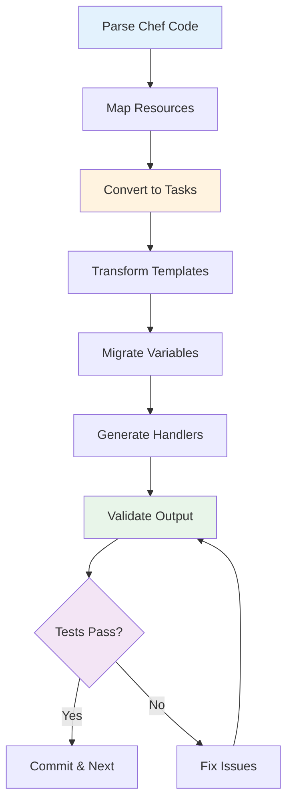

# Conversion Techniques

Detailed guidance on converting Chef cookbooks to Ansible playbooks, including recipes, resources, templates, and complex patterns.

## Conversion Overview

Conversion is where Chef infrastructure code transforms into Ansible playbooks. SousChef automates the heavy lifting while preserving logic and intent.

!!! tip "Iterative Conversion"
    Convert incrementally: one recipe at a time, validate each conversion, then move to the next. This approach catches issues early and builds confidence.

---

## Conversion Strategy



---

## Recipe to Playbook Conversion

### Basic Recipe Conversion

**Chef Recipe:**
```ruby
# recipes/webserver.rb
package 'nginx' do
  action :install
end

service 'nginx' do
  action [:enable, :start]
end

template '/etc/nginx/nginx.conf' do
  source 'nginx.conf.erb'
  owner 'root'
  group 'root'
  mode '0644'
  notifies :reload, 'service[nginx]', :delayed
end
```

**Conversion Command:**

=== "MCP (AI Assistant)"
    ```
    Generate an Ansible playbook from recipes/webserver.rb
    ```

=== "CLI"
    ```bash
    souschef-cli recipe recipes/webserver.rb > analysis.txt
    # Review analysis, then convert
    souschef-cli convert-recipe recipes/webserver.rb > playbooks/webserver.yml
    ```

**Generated Ansible Playbook:**

```yaml
---
- name: Configure web server
  hosts: webservers
  become: true

  tasks:
    - name: Install nginx
      ansible.builtin.package:
        name: nginx
        state: present

    - name: Enable and start nginx
      ansible.builtin.service:
        name: nginx
        enabled: true
        state: started

    - name: Deploy nginx configuration
      ansible.builtin.template:
        src: nginx.conf.j2
        dest: /etc/nginx/nginx.conf
        owner: root
        group: root
        mode: '0644'
      notify: Reload nginx

  handlers:
    - name: Reload nginx
      ansible.builtin.service:
        name: nginx
        state: reloaded
```

### Multi-Recipe Conversion

For cookbooks with multiple recipes:

```bash
# Convert all recipes in cookbook
for recipe in cookbooks/myapp/recipes/*.rb; do
  recipe_name=$(basename "$recipe" .rb)
  echo "Converting: $recipe_name"
  souschef-cli convert-recipe "$recipe" > "playbooks/myapp_${recipe_name}.yml"
done
```

**Organise as Role:**

```
roles/myapp/
├── defaults/
│   └── main.yml          # Default variables
├── tasks/
│   ├── main.yml          # Main entry point
│   ├── install.yml       # From install.rb
│   ├── configure.yml     # From configure.rb
│   └── deploy.yml        # From deploy.rb
├── templates/
│   └── config.j2
└── handlers/
    └── main.yml
```

---

## Resource Mapping

### Core Resource Types

| Chef Resource | Ansible Module | Notes |
|---------------|----------------|-------|
| `package` | `ansible.builtin.package` | Cross-platform |
| `service` | `ansible.builtin.service` | Systemd support |
| `template` | `ansible.builtin.template` | ERB → Jinja2 |
| `file` | `ansible.builtin.file` | Ownership, permissions |
| `directory` | `ansible.builtin.file` | state: directory |
| `user` | `ansible.builtin.user` | User management |
| `group` | `ansible.builtin.group` | Group management |
| `execute` | `ansible.builtin.command` | One-off commands |
| `bash` | `ansible.builtin.shell` | Shell scripts |
| `git` | `ansible.builtin.git` | Git repos |
| `cron` | `ansible.builtin.cron` | Cron jobs |

### Platform-Specific Resources

**Chef Platform-Specific Packages:**
```ruby
# Chef
case node['platform_family']
when 'debian'
  apt_package 'apache2'
when 'rhel'
  yum_package 'httpd'
end
```

**Ansible with Facts:**
```yaml
- name: Install web server (Debian)
  ansible.builtin.apt:
    name: apache2
    state: present
  when: ansible_os_family == 'Debian'

- name: Install web server (RedHat)
  ansible.builtin.yum:
    name: httpd
    state: present
  when: ansible_os_family == 'RedHat'
```

**Or use package module (cross-platform):**
```yaml
- name: Install web server
  ansible.builtin.package:
    name: "{{ 'apache2' if ansible_os_family == 'Debian' else 'httpd' }}"
    state: present
```

---

## Template Conversion

### ERB to Jinja2 Syntax

| Chef ERB | Ansible Jinja2 | Example |
|----------|----------------|---------|
| `<%= @var %>` | `{{ var }}` | Variable interpolation |
| `<% if @condition %>` | `` | Conditionals |
| `<% @items.each do \|item\| %>` | `` | Loops |
| `<%# comment %>` | `{# comment #}` | Comments |
| `<%= node['attr'] %>` | `{{ ansible_local.attr }}` | Facts |

### Template Conversion Process

**Chef Template (nginx.conf.erb):**
```erb
user <%= @user %>;
worker_processes <%= @workers %>;

events {
    worker_connections <%= @connections %>;
}

http {
    <% if @enable_gzip %>
    gzip on;
    gzip_types text/plain text/css application/json;
    <% end %>

    <% @servers.each do |server| %>
    upstream <%= server['name'] %> {
        <% server['backends'].each do |backend| %>
        server <%= backend %>:8080;
        <% end %>
    }
    <% end %>
}
```

**Conversion:**

=== "MCP (AI Assistant)"
    ```
    Convert the ERB template at templates/nginx.conf.erb to Jinja2
    and show me the variable list
    ```

=== "CLI"
    ```bash
    souschef-cli template templates/nginx.conf.erb --format json > template_vars.json
    jq '.variables' template_vars.json
    ```

**Generated Jinja2 (nginx.conf.j2):**
```jinja2
user {{ nginx_user }};
worker_processes {{ nginx_workers }};

events {
    worker_connections {{ nginx_connections }};
}

http {
    
    gzip on;
    gzip_types text/plain text/css application/json;
    

    
    upstream {{ server.name }} {
        
        server {{ backend }}:8080;
        
    }
    
}
```

**Variable File (group_vars/all.yml):**
```yaml
nginx_user: nginx
nginx_workers: 4
nginx_connections: 1024
nginx_enable_gzip: true
nginx_servers:
  - name: app
    backends:
      - 10.0.1.10
      - 10.0.1.11
      - 10.0.1.12
```

---

## Guard Conversion

### Simple Guards

**Chef:**
```ruby
file '/etc/app.conf' do
  action :create
  only_if { ::File.exist?('/opt/app') }
end
```

**Ansible:**
```yaml
- name: Check if app directory exists
  ansible.builtin.stat:
    path: /opt/app
  register: app_dir

- name: Create app configuration
  ansible.builtin.file:
    path: /etc/app.conf
    state: touch
  when: app_dir.stat.exists
```

### Complex Guards

**Chef Multiple Conditions:**
```ruby
execute 'deploy' do
  command '/opt/deploy.sh'
  only_if { ::File.exist?('/opt/app.tar.gz') }
  not_if { ::File.exist?('/opt/.deployed') }
  not_if { node['maintenance_mode'] }
end
```

**Ansible:**
```yaml
- name: Check for deployment archive
  ansible.builtin.stat:
    path: /opt/app.tar.gz
  register: app_archive

- name: Check for deployment marker
  ansible.builtin.stat:
    path: /opt/.deployed
  register: deploy_marker

- name: Run deployment
  ansible.builtin.command:
    cmd: /opt/deploy.sh
  when:
    - app_archive.stat.exists
    - not deploy_marker.stat.exists
    - not maintenance_mode | default(false)
```

### Array-Based Guards

**Chef:**
```ruby
package 'nginx' do
  action :install
  only_if ['test -f /etc/apt/sources.list', 'dpkg --version']
end
```

**Ansible:**
```yaml
- name: Check apt sources
  ansible.builtin.stat:
    path: /etc/apt/sources.list
  register: apt_sources

- name: Check dpkg
  ansible.builtin.command:
    cmd: dpkg --version
  register: dpkg_check
  failed_when: false
  changed_when: false

- name: Install nginx
  ansible.builtin.package:
    name: nginx
    state: present
  when:
    - apt_sources.stat.exists
    - dpkg_check.rc == 0
```

---

## Notification & Handler Conversion

### Immediate vs Delayed Notifications

**Chef:**
```ruby
template '/etc/nginx/nginx.conf' do
  notifies :reload, 'service[nginx]', :delayed
end

template '/etc/app/critical.conf' do
  notifies :restart, 'service[app]', :immediately
end

service 'nginx' do
  action :nothing
end

service 'app' do
  action :nothing
end
```

**Ansible:**
```yaml
# Tasks
- name: Deploy nginx config
  ansible.builtin.template:
    src: nginx.conf.j2
    dest: /etc/nginx/nginx.conf
  notify: Reload nginx

- name: Deploy critical config
  ansible.builtin.template:
    src: critical.conf.j2
    dest: /etc/app/critical.conf
  notify: Restart app

- name: Flush handlers immediately
  meta: flush_handlers  # For immediate effect

# Handlers (handlers/main.yml)
- name: Reload nginx
  ansible.builtin.service:
    name: nginx
    state: reloaded

- name: Restart app
  ansible.builtin.service:
    name: app
    state: restarted
```

### Chained Notifications

**Chef:**
```ruby
template '/etc/app/config.yml' do
  notifies :create, 'file[/var/log/app.log]', :immediately
  notifies :restart, 'service[app]', :delayed
end

file '/var/log/app.log' do
  action :nothing
  notifies :run, 'execute[set-permissions]', :immediately
end
```

**Ansible:**
```yaml
- name: Deploy config
  ansible.builtin.template:
    src: config.yml.j2
    dest: /etc/app/config.yml
  notify:
    - Create log file
    - Restart app

# Handlers execute in order defined
- name: Create log file
  ansible.builtin.file:
    path: /var/log/app.log
    state: touch
  notify: Set log permissions

- name: Set log permissions
  ansible.builtin.command:
    cmd: chmod 666 /var/log/app.log

- name: Restart app
  ansible.builtin.service:
    name: app
    state: restarted
```

---

## Custom Resource Conversion

### Simple Custom Resource

**Chef Custom Resource (resources/app_config.rb):**
```ruby
property :config_name, String, name_property: true
property :settings, Hash, required: true
property :owner, String, default: 'app'

action :create do
  directory "/etc/#{new_resource.config_name}" do
    owner new_resource.owner
    mode '0755'
  end

  file "/etc/#{new_resource.config_name}/config.json" do
    content Chef::JSONCompat.to_json_pretty(new_resource.settings)
    owner new_resource.owner
    mode '0600'
  end
end
```

**Ansible Role Equivalent:**

**roles/app_config/defaults/main.yml:**
```yaml
app_config_owner: app
app_config_mode_dir: '0755'
app_config_mode_file: '0600'
```

**roles/app_config/tasks/main.yml:**
```yaml
- name: Create config directory
  ansible.builtin.file:
    path: "/etc/{{ config_name }}"
    state: directory
    owner: "{{ app_config_owner }}"
    mode: "{{ app_config_mode_dir }}"

- name: Deploy configuration file
  ansible.builtin.copy:
    content: "{{ settings | to_nice_json }}"
    dest: "/etc/{{ config_name }}/config.json"
    owner: "{{ app_config_owner }}"
    mode: "{{ app_config_mode_file }}"
```

**Usage in Playbook:**
```yaml
- name: Configure application
  ansible.builtin.include_role:
    name: app_config
  vars:
    config_name: myapp
    settings:
      database_url: postgresql://localhost/myapp
      log_level: info
      port: 8080
```

### Complex Custom Resource → Custom Module

For very complex resources, create an Ansible module:

**module_utils/app_deployment.py:**
```python
#!/usr/bin/python
from ansible.module_utils.basic import AnsibleModule

def deploy_app(module, app_name, version, config):
    """Deploy application with complex logic."""
    changed = False

    # Complex deployment logic here
    # ...

    return changed, "Deployment successful"

def main():
    module = AnsibleModule(
        argument_spec=dict(
            app_name=dict(type='str', required=True),
            version=dict(type='str', required=True),
            config=dict(type='dict', required=True),
            state=dict(type='str', default='present',
                      choices=['present', 'absent'])
        )
    )

    changed, message = deploy_app(
        module,
        module.params['app_name'],
        module.params['version'],
        module.params['config']
    )

    module.exit_json(changed=changed, msg=message)

if __name__ == '__main__':
    main()
```

---

## Attribute Migration

### Attribute Precedence Mapping

**Chef Precedence Levels:**
1. Automatic (highest)
2. Force Override
3. Override
4. Normal
5. Force Default
6. Default (lowest)

**Ansible Variable Precedence (simplified):**
1. Extra vars (highest)
2. Task vars
3. Block vars
4. Role vars
5. Play vars
6. Host vars
7. Group vars (priority order)
8. Role defaults (lowest)

**Migration Strategy:**

| Chef Level | Ansible Equivalent | Location |
|------------|-------------------|----------|
| Default | Role defaults | `roles/*/defaults/main.yml` |
| Force Default | Group vars (all) | `group_vars/all.yml` |
| Normal | Host vars | `host_vars/hostname.yml` |
| Override | Group vars (specific) | `group_vars/production.yml` |
| Force Override | Play vars | In playbook |
| Automatic | Facts | `ansible_facts.*` |

**Chef Attributes (attributes/default.rb):**
```ruby
default['app']['port'] = 8080
default['app']['workers'] = 4
override['app']['log_level'] = 'info'
```

**Ansible Variables:**

**roles/app/defaults/main.yml:**
```yaml
app_port: 8080
app_workers: 4
```

**group_vars/all.yml:**
```yaml
app_log_level: info
```

**Override in Inventory:**
```yaml
# group_vars/production.yml
app_port: 9090
app_workers: 8
app_log_level: warn
```

---

## Data Bag Migration

### Unencrypted Data Bags

**Chef Data Bag (data_bags/users/john.json):**
```json
{
  "id": "john",
  "full_name": "John Doe",
  "email": "john@example.com",
  "groups": ["developers", "docker"]
}
```

**Ansible Variables (group_vars/all/users.yml):**
```yaml
users:
  john:
    full_name: John Doe
    email: john@example.com
    groups:
      - developers
      - docker
```

### Encrypted Data Bags to Ansible Vault

**Chef Encrypted Data Bag:**
```bash
# Decrypt Chef data bag
knife data bag show secrets database --secret-file ~/.chef/encrypted_data_bag_secret -Fj > database_secrets.json
```

**Convert to Ansible Vault:**

=== "MCP (AI Assistant)"
    ```
    Convert the data bag at database_secrets.json to Ansible Vault format
    ```

=== "CLI"
    ```bash
    # Create vault file
    cat > group_vars/all/vault.yml <<EOF
    vault_db_password: "{{ lookup('file', 'database_secrets.json') | from_json | json_query('password') }}"
    vault_db_host: "{{ lookup('file', 'database_secrets.json') | from_json | json_query('host') }}"
    EOF

    # Encrypt with Ansible Vault
    ansible-vault encrypt group_vars/all/vault.yml
    ```

**Reference in Playbook:**
```yaml
- name: Configure database
  ansible.builtin.template:
    src: database.yml.j2
    dest: /etc/app/database.yml
  vars:
    db_password: "{{ vault_db_password }}"
    db_host: "{{ vault_db_host }}"
  no_log: true
```

---

## Environment Conversion

**Chef Environment (environments/production.rb):**
```ruby
name 'production'
description 'Production environment'

override_attributes(
  'app' => {
    'port' => 80,
    'workers' => 8,
    'log_level' => 'warn'
  }
)
```

**Ansible Inventory Structure:**
```yaml
# inventory/production/hosts.yml
all:
  children:
    production:
      hosts:
        app01:
          ansible_host: 10.0.1.10
        app02:
          ansible_host: 10.0.1.11

# inventory/production/group_vars/production.yml
app_port: 80
app_workers: 8
app_log_level: warn
environment: production
```

---

## Validation During Conversion

### Syntax Validation

After each conversion:

```bash
# Validate YAML syntax
ansible-playbook playbooks/myapp.yml --syntax-check

# Validate with ansible-lint
ansible-lint playbooks/myapp.yml

# Check mode (dry run)
ansible-playbook playbooks/myapp.yml --check -i inventory/dev
```

### Semantic Validation with SousChef

```bash
# Validate conversion accuracy
souschef-cli validate playbook \
  --original recipes/myapp.rb \
  --converted playbooks/myapp.yml \
  --format text
```

**Validation Output:**
```
✓ Syntax: PASSED (YAML valid)
✓ Semantic: PASSED (Logic preserved)
⚠ Best Practice: 2 warnings
  - Consider using 'package' instead of 'apt'
  - Add 'become: true' for privilege escalation
✓ Security: PASSED
✓ Performance: PASSED

Overall: PASSED with warnings
```

---

## Conversion Checklist

### Per-Recipe Checklist

- [ ] Parse recipe with `parse_recipe`
- [ ] Review resource types and actions
- [ ] Identify notification chains
- [ ] Check guard conditions
- [ ] Convert recipe to playbook
- [ ] Transform templates (ERB → Jinja2)
- [ ] Map variables (attributes → vars)
- [ ] Create handlers for notifications
- [ ] Validate syntax
- [ ] Test in development
- [ ] Verify idempotency
- [ ] Document any manual changes

### Per-Cookbook Checklist

- [ ] Convert all recipes
- [ ] Migrate custom resources to roles/modules
- [ ] Transform all templates
- [ ] Migrate attribute files
- [ ] Convert data bags to vars/vault
- [ ] Update environment-specific variables
- [ ] Generate InSpec tests
- [ ] Organise as role (if appropriate)
- [ ] Create README with usage examples
- [ ] Tag in version control

---

## Best Practices

### Do's ✅

1. **Convert One Recipe at a Time**: Test each before moving to next
2. **Preserve Intent**: Focus on what the code does, not how
3. **Use Native Modules**: Prefer Ansible modules over shell commands
4. **Validate Continuously**: Check syntax and semantics after each conversion
5. **Test Idempotency**: Run playbooks multiple times
6. **Document Changes**: Note any manual modifications
7. **Organise into Roles**: Structure for reusability
8. **Version Control**: Commit after each successful conversion

### Don'ts ❌

1. **Don't Skip Testing**: Always test converted code
2. **Don't Ignore Warnings**: Validation warnings indicate issues
3. **Don't Convert Blindly**: Understand the Chef code first
4. **Don't Forget Handlers**: Notifications must be preserved
5. **Don't Mix Concerns**: Keep tasks focused and organised
6. **Don't Hardcode Values**: Use variables for flexibility
7. **Don't Skip Documentation**: Document complex conversions
8. **Don't Rush**: Thorough conversion prevents rework

---

## Troubleshooting

### Issue: Resource Not Converting Properly

**Problem**: Chef resource doesn't have direct Ansible equivalent

**Solution**:
1. Check Ansible Galaxy for community collections
2. Use `ansible.builtin.command` as fallback
3. Create custom module for complex logic
4. Document the conversion approach

### Issue: Guard Logic Too Complex

**Problem**: Complex Ruby guards don't convert cleanly

**Solution**:
```yaml
# Break into separate fact-gathering and conditional tasks
- name: Gather deployment facts
  ansible.builtin.set_fact:
    can_deploy: "{{ (app_archive.stat.exists and
                     not deploy_marker.stat.exists and
                     not maintenance_mode) | bool }}"

- name: Deploy if conditions met
  ansible.builtin.command:
    cmd: /opt/deploy.sh
  when: can_deploy
```

### Issue: Notification Timing

**Problem**: Chef immediate vs delayed notifications

**Solution**:
```yaml
# Use meta: flush_handlers for immediate effect
- name: Critical config change
  ansible.builtin.template:
    src: critical.j2
    dest: /etc/app/critical.conf
  notify: Restart app immediately

- name: Force handler execution
  meta: flush_handlers
```

---

## Next Steps

After completing conversions:

1. **[Review Deployment Strategies](deployment.md)** - Plan production deployment
2. **[Validation Testing](overview.md#phase-4-validation-testing)** - Comprehensive testing
3. **[Examples](../user-guide/examples.md)** - Real-world conversion patterns

Or explore related topics:

- [MCP Tools Reference](../user-guide/mcp-tools.md) - Conversion tool details
- [CLI Usage](../user-guide/cli-usage.md) - Command-line conversion
- [Assessment Guide](assessment.md) - Pre-conversion assessment

!!! success "Ready to Convert?"
    Use SousChef's conversion tools to transform Chef cookbooks systematically. Start simple, validate continuously, and build confidence with each successful conversion.
