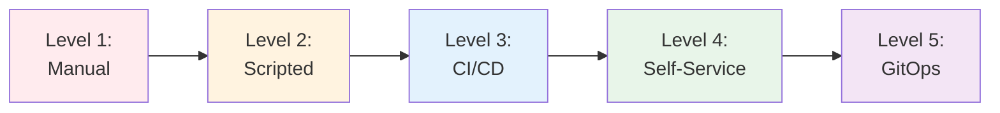
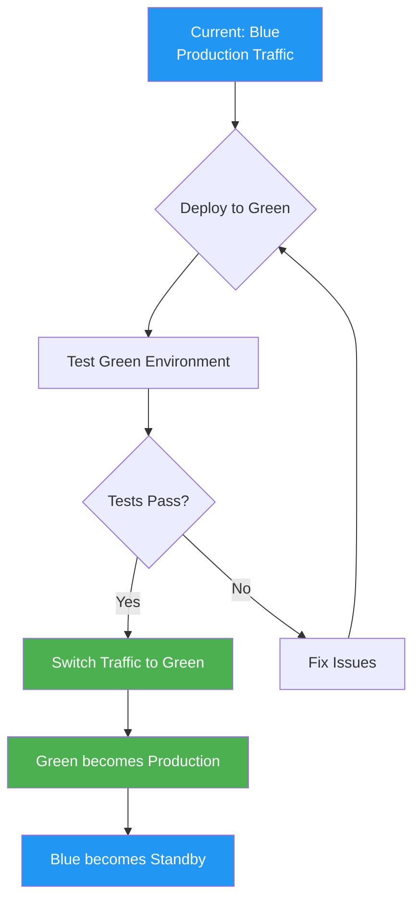
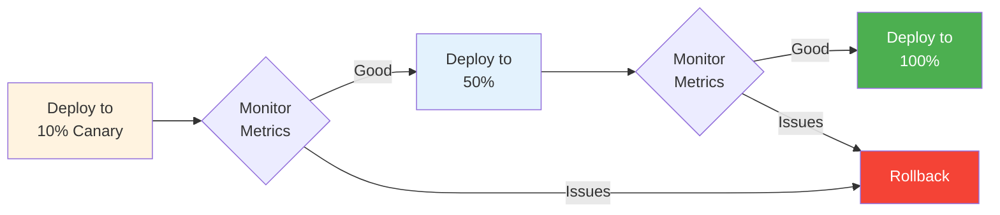
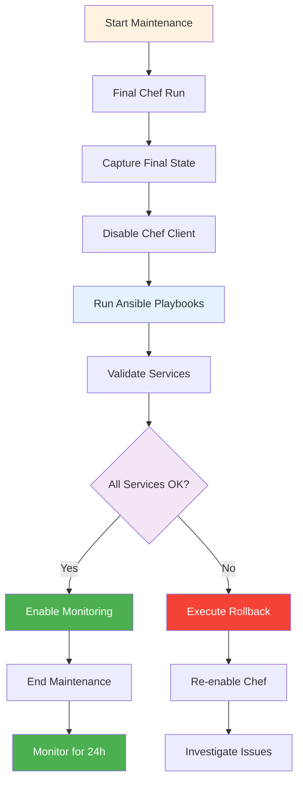

# Deployment Strategies

Comprehensive guide to deploying Ansible playbooks to production, including AWX/Tower integration, deployment patterns, and production cutover.

## Deployment Overview

Successful deployment requires careful planning, testing, and execution. This guide covers strategies from simple direct deployment to enterprise-grade automation with AWX.

!!! warning "Production Safety"
    Always test in non-production environments first. Use check mode, limit flags, and rollback plans for every production deployment.

---

## Deployment Maturity Levels



| Level | Approach | Tools | Best For |
|-------|----------|-------|----------|
| 1 | Manual execution | `ansible-playbook` CLI | Development, learning |
| 2 | Shell scripts | Bash + Ansible | Small teams |
| 3 | CI/CD pipelines | Jenkins, GitLab CI | Medium orgs |
| 4 | Self-service platform | AWX, Tower | Enterprise |
| 5 | GitOps | ArgoCD, Flux | Cloud-native |

---

## Deployment Patterns

### Blue-Green Deployment

**Overview**: Maintain two identical environments, switch traffic after validation.



**Implementation:**

```yaml
---
- name: Blue-Green Deployment
  hosts: localhost
  gather_facts: false
  vars:
    current_env: blue
    target_env: green

  tasks:
    - name: Deploy to green environment
      ansible.builtin.include_role:
        name: application
      vars:
        environment: "{{ target_env }}"
        ansible_limit: "{{ target_env }}_servers"

    - name: Run smoke tests on green
      ansible.builtin.uri:
        url: "https://{{ target_env }}.example.com/health"
        status_code: 200
      register: health_check
      retries: 5
      delay: 10

    - name: Switch load balancer to green
      community.general.haproxy:
        backend: app_backend
        host: "{{ target_env }}_servers"
        state: enabled
      when: health_check.status == 200

    - name: Disable blue environment
      community.general.haproxy:
        backend: app_backend
        host: "{{ current_env }}_servers"
        state: disabled

    - name: Update environment marker
      ansible.builtin.set_fact:
        cacheable: true
        current_production: "{{ target_env }}"
```

**Benefits**:
- Zero downtime
- Instant rollback (switch back to blue)
- Full testing before cutover

**Drawbacks**:
- Requires double infrastructure
- Database migrations need special handling

### Canary Deployment

**Overview**: Gradually roll out to subset of servers, monitor, then expand.



**Implementation:**

```yaml
---
- name: Canary Deployment
  hosts: app_servers
  serial: "{{ rollout_percentage | default('10%') }}"
  max_fail_percentage: 5

  tasks:
    - name: Deploy new version
      ansible.builtin.include_role:
        name: application
      vars:
        app_version: "{{ new_version }}"

    - name: Wait for service to stabilize
      ansible.builtin.pause:
        seconds: 30

    - name: Check service health
      ansible.builtin.uri:
        url: "http://localhost:8080/health"
        status_code: 200
      register: health
      retries: 3
      delay: 5

    - name: Monitor error rates
      ansible.builtin.command:
        cmd: curl -s http://localhost:9090/metrics | grep error_rate
      register: metrics
      failed_when: "'error_rate > 0.05' in metrics.stdout"

    - name: Pause for monitoring
      ansible.builtin.pause:
        prompt: "Review metrics before continuing (Enter to proceed)"
      when: rollout_percentage == '10%'
```

**Progressive Rollout:**

```bash
# Stage 1: 10% canary
ansible-playbook deploy.yml -e "rollout_percentage=10%" -e "new_version=2.0.0"

# Monitor for 15 minutes, check metrics

# Stage 2: 50% rollout
ansible-playbook deploy.yml -e "rollout_percentage=50%" -e "new_version=2.0.0"

# Monitor for 15 minutes

# Stage 3: Full rollout
ansible-playbook deploy.yml -e "rollout_percentage=100%" -e "new_version=2.0.0"
```

**Benefits**:
- Low risk (limited exposure)
- Real-world validation
- Easy to halt if issues arise

**Drawbacks**:
- Longer deployment time
- Requires good monitoring
- Version mixing during rollout

### Rolling Deployment

**Overview**: Update servers one at a time or in small batches.

```yaml
---
- name: Rolling Deployment
  hosts: app_servers
  serial: 2  # Update 2 servers at a time

  pre_tasks:
    - name: Remove server from load balancer
      community.general.haproxy:
        backend: app_backend
        host: "{{ inventory_hostname }}"
        state: disabled
      delegate_to: localhost

  tasks:
    - name: Stop application
      ansible.builtin.service:
        name: myapp
        state: stopped

    - name: Deploy new version
      ansible.builtin.include_role:
        name: application

    - name: Start application
      ansible.builtin.service:
        name: myapp
        state: started

    - name: Wait for service to be ready
      ansible.builtin.wait_for:
        port: 8080
        delay: 5
        timeout: 60

  post_tasks:
    - name: Add server back to load balancer
      community.general.haproxy:
        backend: app_backend
        host: "{{ inventory_hostname }}"
        state: enabled
      delegate_to: localhost

    - name: Health check
      ansible.builtin.uri:
        url: "http://{{ inventory_hostname }}:8080/health"
        status_code: 200
```

**Benefits**:
- No extra infrastructure needed
- Predictable deployment time
- Easy to automate

**Drawbacks**:
- Some downtime per server
- Requires load balancer
- Mixed versions during deployment

### Parallel Run Strategy

**Overview**: Run Chef and Ansible simultaneously during transition.

**Implementation:**

```yaml
---
- name: Parallel Run Verification
  hosts: migration_targets

  tasks:
    - name: Run Chef client
      ansible.builtin.command:
        cmd: chef-client
      register: chef_run
      changed_when: "'updated' in chef_run.stdout"

    - name: Capture Chef state
      ansible.builtin.command:
        cmd: knife node show {{ inventory_hostname }} -a
      register: chef_state
      delegate_to: localhost

    - name: Run Ansible playbook
      ansible.builtin.include_role:
        name: application
      register: ansible_run

    - name: Capture Ansible state
      ansible.builtin.setup:
      register: ansible_state

    - name: Compare states
      ansible.builtin.assert:
        that:
          - chef_state.rc == 0
          - ansible_run is succeeded
        msg: "Chef and Ansible runs must both succeed"

    - name: Report differences
      ansible.builtin.debug:
        msg: "Differences detected: {{ diff }}"
      vars:
        diff: "{{ chef_state.stdout | difference(ansible_state.ansible_facts) }}"
      when: diff | length > 0
```

**Benefits**:
- Low risk (Chef still active)
- Validates Ansible accuracy
- Gradual confidence building

**Drawbacks**:
- Requires Chef infrastructure
- May cause conflicts
- Extended transition period

---

## AWX/Ansible Tower Integration

### AWX Setup for SousChef

**Install AWX (via Docker Compose):**

=== "MCP (AI Assistant)"
    ```
    Generate AWX job templates for the converted playbooks in playbooks/ directory
    ```

=== "CLI"
    ```bash
    souschef-cli generate-awx-config \
      --playbooks-dir playbooks/ \
      --output awx_config.yml
    ```

**Generated AWX Configuration:**

```yaml
---
awx_projects:
  - name: Infrastructure Automation
    description: Converted Chef cookbooks
    organization: Engineering
    scm_type: git
    scm_url: https://github.com/myorg/ansible-playbooks.git
    scm_branch: main
    scm_update_on_launch: true

awx_inventories:
  - name: Production
    description: Production servers
    organization: Engineering
    variables:
      environment: production
      ansible_user: ansible

awx_job_templates:
  - name: Deploy Web Application
    job_type: run
    inventory: Production
    project: Infrastructure Automation
    playbook: playbooks/webserver.yml
    credentials:
      - SSH Key
      - Vault Password
    extra_vars:
      app_version: "{{ app_version }}"
    survey_enabled: true
    survey_spec:
      name: Deployment Survey
      description: Configure deployment parameters
      spec:
        - question_name: Application Version
          variable: app_version
          type: text
          required: true
        - question_name: Environment
          variable: target_env
          type: multiplechoice
          choices:
            - dev
            - staging
            - production
          required: true

  - name: Database Migration
    job_type: run
    inventory: Production
    project: Infrastructure Automation
    playbook: playbooks/database.yml
    credentials:
      - SSH Key
      - Database Credentials
    ask_variables_on_launch: true

awx_workflows:
  - name: Full Application Deployment
    organization: Engineering
    nodes:
      - identifier: pre_checks
        unified_job_template: Pre-Deployment Checks
        success_nodes:
          - database_migration

      - identifier: database_migration
        unified_job_template: Database Migration
        success_nodes:
          - app_deployment

      - identifier: app_deployment
        unified_job_template: Deploy Web Application
        success_nodes:
          - smoke_tests

      - identifier: smoke_tests
        unified_job_template: Smoke Tests
        success_nodes:
          - notify_success
        failure_nodes:
          - rollback

      - identifier: rollback
        unified_job_template: Rollback Deployment
        always_nodes:
          - notify_failure
```

### Import to AWX

**Using AWX CLI:**

```bash
# Install awxkit
pip install awxkit

# Login
export TOWER_HOST=https://awx.example.com
export TOWER_USERNAME=admin
export TOWER_PASSWORD=secret
export TOWER_VERIFY_SSL=false

# Import configuration
awx-cli receive --conf.host=$TOWER_HOST \
  --conf.username=$TOWER_USERNAME \
  --conf.password=$TOWER_PASSWORD \
  --conf.insecure < awx_config.yml
```

**Using AWX Collection:**

```yaml
---
- name: Configure AWX
  hosts: localhost
  gather_facts: false
  collections:
    - awx.awx

  tasks:
    - name: Create organization
      awx.awx.organization:
        name: Engineering
        description: Engineering team resources
        state: present

    - name: Create project
      awx.awx.project:
        name: Infrastructure Automation
        organization: Engineering
        scm_type: git
        scm_url: https://github.com/myorg/ansible-playbooks.git
        state: present

    - name: Create inventory
      awx.awx.inventory:
        name: Production
        organization: Engineering
        state: present

    - name: Create job template
      awx.awx.job_template:
        name: Deploy Web Application
        job_type: run
        organization: Engineering
        inventory: Production
        project: Infrastructure Automation
        playbook: playbooks/webserver.yml
        state: present
```

### Dynamic Inventory

**Chef Search Equivalent:**

**Chef:**
```ruby
# Search for web servers
search(:node, 'role:webserver AND chef_environment:production').each do |node|
  # Do something
end
```

**AWX Dynamic Inventory Script:**

```python
#!/usr/bin/env python3
"""
AWX dynamic inventory from Chef Server or custom CMDB.
"""
import json
import sys
import requests

def get_chef_nodes():
    """Query Chef Server for nodes."""
    response = requests.get(
        'https://chef-server.example.com/nodes',
        headers={'Authorization': f'Bearer {CHEF_TOKEN}'},
        verify=False
    )
    return response.json()

def build_inventory():
    """Build Ansible inventory from Chef data."""
    inventory = {
        '_meta': {
            'hostvars': {}
        },
        'all': {
            'hosts': [],
            'vars': {}
        }
    }

    nodes = get_chef_nodes()

    for node in nodes:
        hostname = node['name']
        inventory['all']['hosts'].append(hostname)

        # Add to role-based groups
        for role in node.get('roles', []):
            if role not in inventory:
                inventory[role] = {'hosts': []}
            inventory[role]['hosts'].append(hostname)

        # Add hostvars
        inventory['_meta']['hostvars'][hostname] = {
            'ansible_host': node['ipaddress'],
            'chef_environment': node['chef_environment'],
            'platform': node['platform'],
            'platform_version': node['platform_version']
        }

    return inventory

if __name__ == '__main__':
    if len(sys.argv) == 2 and sys.argv[1] == '--list':
        inventory = build_inventory()
        print(json.dumps(inventory, indent=2))
    else:
        print(json.dumps({}))
```

**Configure in AWX:**

1. Create inventory source
2. Set source to "Custom Script"
3. Upload inventory script
4. Set sync schedule (e.g., hourly)

---

## Secrets Management

### Ansible Vault Migration

**From Chef Encrypted Data Bags:**

```bash
# Extract Chef secrets
knife data bag show secrets database \
  --secret-file ~/.chef/encrypted_data_bag_secret \
  -Fj > database_secrets.json

# Convert to Ansible Vault format
cat > group_vars/production/vault.yml <<EOF
---
vault_db_host: $(jq -r '.host' database_secrets.json)
vault_db_port: $(jq -r '.port' database_secrets.json)
vault_db_user: $(jq -r '.username' database_secrets.json)
vault_db_password: $(jq -r '.password' database_secrets.json)
EOF

# Encrypt with Ansible Vault
ansible-vault encrypt group_vars/production/vault.yml
```

**Reference in Playbook:**

```yaml
---
- name: Configure application
  hosts: app_servers
  vars_files:
    - group_vars/production/vault.yml

  tasks:
    - name: Deploy database configuration
      ansible.builtin.template:
        src: database.yml.j2
        dest: /etc/app/database.yml
      vars:
        db_host: "{{ vault_db_host }}"
        db_password: "{{ vault_db_password }}"
      no_log: true
```

### AWX Credentials

**Create Credential Types:**

```yaml
---
- name: Create custom credential type for database
  awx.awx.credential_type:
    name: Database Credentials
    kind: cloud
    inputs:
      fields:
        - id: db_host
          type: string
          label: Database Host
        - id: db_port
          type: string
          label: Database Port
        - id: db_username
          type: string
          label: Username
        - id: db_password
          type: string
          label: Password
          secret: true
    injectors:
      extra_vars:
        database_host: "{{ db_host }}"
        database_port: "{{ db_port }}"
        database_username: "{{ db_username }}"
        database_password: "{{ db_password }}"
    state: present

- name: Create credential
  awx.awx.credential:
    name: Production Database
    organization: Engineering
    credential_type: Database Credentials
    inputs:
      db_host: postgres.example.com
      db_port: 5432
      db_username: app_user
      db_password: !vault |
        $ANSIBLE_VAULT;1.1;AES256
        ...encrypted...
    state: present
```

### External Secret Managers

**HashiCorp Vault Integration:**

```yaml
---
- name: Retrieve secrets from Vault
  hosts: app_servers

  tasks:
    - name: Get database credentials
      community.hashi_vault.vault_read:
        url: https://vault.example.com
        path: secret/data/production/database
        auth_method: token
        token: "{{ lookup('env', 'VAULT_TOKEN') }}"
      register: vault_secrets

    - name: Deploy configuration
      ansible.builtin.template:
        src: database.yml.j2
        dest: /etc/app/database.yml
      vars:
        db_password: "{{ vault_secrets.data.data.password }}"
      no_log: true
```

---

## Production Cutover

### Pre-Cutover Checklist

**Weeks Before:**

- [ ] Complete parallel runs (Chef + Ansible)
- [ ] Validate all conversions in staging
- [ ] Train operations team on Ansible
- [ ] Document rollback procedures
- [ ] Set up monitoring and alerting
- [ ] Schedule maintenance window
- [ ] Communicate to stakeholders

**Days Before:**

- [ ] Final parallel run validation
- [ ] Backup all Chef cookbooks
- [ ] Backup Chef Server configuration
- [ ] Review rollback plan with team
- [ ] Prepare runbooks
- [ ] Test rollback procedure
- [ ] Verify monitoring endpoints

**Day Of:**

- [ ] Announce maintenance window
- [ ] Take final Chef Server backup
- [ ] Freeze Chef cookbook changes
- [ ] Enable detailed logging
- [ ] Notify stakeholders (start)

### Cutover Execution



**Cutover Playbook:**

```yaml
---
- name: Production Cutover - Chef to Ansible
  hosts: all
  gather_facts: true
  serial: 10%  # Process 10% of servers at a time

  pre_tasks:
    - name: Announce cutover start
      ansible.builtin.debug:
        msg: "Starting cutover for {{ inventory_hostname }} at {{ ansible_date_time.iso8601 }}"

    - name: Final Chef client run
      ansible.builtin.command:
        cmd: chef-client
      register: final_chef_run
      ignore_errors: true

    - name: Capture Chef-managed resources
      ansible.builtin.command:
        cmd: chef-client --why-run --format json
      register: chef_state

    - name: Disable Chef client
      ansible.builtin.service:
        name: chef-client
        state: stopped
        enabled: false

    - name: Remove Chef from cron
      ansible.builtin.cron:
        name: "Chef client"
        state: absent

  tasks:
    - name: Run Ansible configuration
      ansible.builtin.include_role:
        name: "{{ item }}"
      loop: "{{ required_roles }}"

    - name: Validate services
      ansible.builtin.service:
        name: "{{ item }}"
        state: started
      loop: "{{ critical_services }}"
      register: service_check

    - name: Run smoke tests
      ansible.builtin.uri:
        url: "http://localhost:{{ app_port }}/health"
        status_code: 200
      register: health_check
      retries: 3
      delay: 10

  post_tasks:
    - name: Mark cutover complete
      ansible.builtin.file:
        path: /etc/ansible_cutover_complete
        state: touch
        mode: '0644'

    - name: Log cutover completion
      ansible.builtin.lineinfile:
        path: /var/log/ansible-cutover.log
        line: "Cutover completed: {{ ansible_date_time.iso8601 }}"
        create: true

  rescue:
    - name: Cutover failed - initiating rollback
      ansible.builtin.debug:
        msg: "CUTOVER FAILED - Rolling back to Chef"

    - name: Re-enable Chef client
      ansible.builtin.service:
        name: chef-client
        state: started
        enabled: true

    - name: Run Chef client
      ansible.builtin.command:
        cmd: chef-client

    - name: Log rollback
      ansible.builtin.lineinfile:
        path: /var/log/ansible-cutover.log
        line: "Rollback executed: {{ ansible_date_time.iso8601 }}"
        create: true

    - name: Notify team
      ansible.builtin.debug:
        msg: "ALERT: Cutover failed and rolled back. Check logs."
```

**Execution:**

```bash
# Dry run first
ansible-playbook cutover.yml --check -i inventory/production

# Execute cutover
ansible-playbook cutover.yml -i inventory/production \
  -e "required_roles=[webserver,database,monitoring]" \
  -e "critical_services=[nginx,postgresql,myapp]" \
  -e "app_port=8080" \
  --diff
```

### Post-Cutover Validation

**Immediate (0-4 hours):**

```bash
# Service health checks
ansible all -i inventory/production -m service_facts
ansible all -i inventory/production -m shell -a "systemctl list-units --failed"

# Application health
ansible webservers -i inventory/production -m uri \
  -a "url=http://localhost/health status_code=200"

# Log analysis
ansible all -i inventory/production -m shell \
  -a "grep -i error /var/log/syslog | tail -20"

# Compare states
ansible all -i inventory/production -m setup > ansible_state.json
# Compare with pre-cutover Chef state
```

**Extended (4-24 hours):**

```bash
# Monitor resource usage
ansible all -m shell -a "top -b -n 1 | head -20"
ansible all -m shell -a "df -h"
ansible all -m shell -a "free -m"

# Check for configuration drift
ansible-playbook validate_configuration.yml --check --diff

# Run full test suite
ansible-playbook test_suite.yml -i inventory/production
```

---

## Monitoring & Alerting

### Deployment Monitoring

**Prometheus Metrics:**

```yaml
---
- name: Expose deployment metrics
  hosts: localhost
  tasks:
    - name: Record deployment start
      community.general.prometheus:
        name: ansible_deployment_start
        value: 1
        labels:
          playbook: "{{ ansible_play_name }}"
          environment: production

    - name: Include deployment tasks
      ansible.builtin.include_tasks: deploy.yml
      register: deploy_result

    - name: Record deployment success
      community.general.prometheus:
        name: ansible_deployment_success
        value: 1
        labels:
          playbook: "{{ ansible_play_name }}"
          environment: production
      when: deploy_result is succeeded

    - name: Record deployment failure
      community.general.prometheus:
        name: ansible_deployment_failure
        value: 1
        labels:
          playbook: "{{ ansible_play_name }}"
          environment: production
      when: deploy_result is failed
```

**Grafana Dashboard:**

```json
{
  "dashboard": {
    "title": "Ansible Deployments",
    "panels": [
      {
        "title": "Deployment Success Rate",
        "targets": [
          {
            "expr": "rate(ansible_deployment_success[5m]) / rate(ansible_deployment_start[5m])"
          }
        ]
      },
      {
        "title": "Failed Deployments",
        "targets": [
          {
            "expr": "ansible_deployment_failure"
          }
        ]
      }
    ]
  }
}
```

### Integration with Existing Monitoring

**Send alerts to Slack:**

```yaml
---
- name: Notify on deployment
  hosts: localhost
  tasks:
    - name: Send Slack notification
      community.general.slack:
        token: "{{ slack_token }}"
        channel: "#deployments"
        msg: |
          🚀 Deployment started
          Playbook: {{ ansible_play_name }}
          Environment: {{ environment }}
          Initiated by: {{ ansible_user_id }}
```

---

## Rollback Procedures

### Automated Rollback

```yaml
---
- name: Rollback Deployment
  hosts: app_servers

  vars:
    previous_version: "{{ lookup('file', '/tmp/previous_version.txt') }}"

  tasks:
    - name: Stop current version
      ansible.builtin.service:
        name: myapp
        state: stopped

    - name: Restore previous version
      ansible.builtin.copy:
        src: "/opt/backups/myapp-{{ previous_version }}.tar.gz"
        dest: /opt/myapp/
        remote_src: true

    - name: Extract backup
      ansible.builtin.unarchive:
        src: "/opt/myapp/myapp-{{ previous_version }}.tar.gz"
        dest: /opt/myapp/
        remote_src: true

    - name: Start previous version
      ansible.builtin.service:
        name: myapp
        state: started

    - name: Verify rollback
      ansible.builtin.uri:
        url: http://localhost:8080/health
        status_code: 200
```

---

## Deployment Checklist

### Pre-Deployment

- [ ] Code reviewed and approved
- [ ] Tests passing in CI/CD
- [ ] Staging deployment successful
- [ ] Rollback plan documented
- [ ] Maintenance window scheduled
- [ ] Stakeholders notified
- [ ] Monitoring configured
- [ ] Backup completed

### During Deployment

- [ ] Enable detailed logging
- [ ] Announce maintenance start
- [ ] Execute deployment playbook
- [ ] Monitor for errors
- [ ] Validate services
- [ ] Run smoke tests
- [ ] Check monitoring dashboards

### Post-Deployment

- [ ] Announce completion
- [ ] Monitor for 4+ hours
- [ ] Verify metrics
- [ ] Check logs for errors
- [ ] Validate functionality
- [ ] Update documentation
- [ ] Conduct retrospective

---

## Best Practices

### Do's ✅

1. **Test in Lower Environments**: Always deploy to dev/staging first
2. **Use Check Mode**: Validate with `--check` before actual run
3. **Monitor Continuously**: Watch metrics during and after deployment
4. **Automate Rollbacks**: Have automated rollback procedures
5. **Communicate Clearly**: Keep stakeholders informed
6. **Version Everything**: Tag releases, track versions
7. **Document Changes**: Maintain deployment logs
8. **Practice Rollbacks**: Test rollback procedures regularly

### Don'ts ❌

1. **Don't Deploy Fridays**: Avoid end-of-week deployments
2. **Don't Skip Testing**: Always test before production
3. **Don't Deploy Without Backup**: Always have rollback plan
4. **Don't Ignore Warnings**: Address all warnings before deploying
5. **Don't Deploy During Peak**: Use maintenance windows
6. **Don't Deploy Alone**: Have team support available
7. **Don't Skip Validation**: Always run post-deployment checks

---

## Troubleshooting

### Deployment Failures

**Symptom**: Playbook fails partway through

**Solution**:
```bash
# Check where it failed
ansible-playbook deploy.yml --start-at-task="Task that failed"

# Run in step mode
ansible-playbook deploy.yml --step

# Increase verbosity
ansible-playbook deploy.yml -vvv
```

### Service Won't Start After Deployment

**Symptom**: Application service fails to start

**Solution**:
```bash
# Check service status
ansible all -m systemd -a "name=myapp state=status"

# Check logs
ansible all -m shell -a "journalctl -u myapp -n 50"

# Validate configuration
ansible all -m shell -a "myapp --validate-config"
```

### Configuration Drift Detected

**Symptom**: Configuration differs from expected state

**Solution**:
```bash
# Identify differences
ansible-playbook deploy.yml --check --diff

# Re-run configuration
ansible-playbook deploy.yml --tags=config

# Reset to known state
ansible-playbook deploy.yml --force
```

---

## Next Steps

**Complete the migration:**

1. **[Review Conversion Guide](conversion.md)** - Ensure conversions are accurate
2. **[Assessment Guide](assessment.md)** - Validate complexity assessment
3. **[Examples](../user-guide/examples.md)** - Review deployment examples

**Explore automation:**

- [AWX Documentation](https://docs.ansible.com/ansible-tower/)
- [Ansible Best Practices](https://docs.ansible.com/ansible/latest/user_guide/playbooks_best_practices.html)
- [GitOps Workflows](https://www.gitops.tech/)

!!! success "Production Ready"
    With proper planning, testing, and monitoring, your Ansible deployment will be smooth and reliable. Start small, automate incrementally, and scale with confidence.
