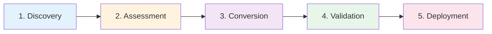

# SaltStack to Ansible Migration Guide

This guide provides a comprehensive methodology for migrating from SaltStack to Ansible, leveraging SousChef's 12 Salt migration tools and proven enterprise practices.

!!! note "Chef Migration"
    If you are also migrating Chef infrastructure, see the [Chef-to-Ansible Migration Guide](overview.md). The phased methodology described there—Discovery, Assessment, Conversion, Validation, Deployment—applies equally to Salt migrations. This guide focuses on Salt-specific concepts and tooling.

## Migration Philosophy

!!! quote "Understand First, Convert Smart"
    Salt and Ansible share the same goal—idempotent configuration management—but express it very differently. A successful migration maps Salt's event-driven, master-minion model onto Ansible's push-based, agentless architecture.

### Core Principles

1. **Assessment First**: Understand your Salt state tree before converting
2. **Pillar Before States**: Migrate data (pillars) before converting state logic
3. **Incremental Migration**: Start with leaf states (no dependencies), build expertise
4. **Validate Equivalence**: Verify that converted playbooks produce identical system states
5. **Inventory is Everything**: top.sls targeting logic becomes your Ansible inventory

---

## Salt Concepts → Ansible Equivalents

Understanding how Salt concepts map to Ansible is essential for a clean migration.

| Salt Concept | Ansible Equivalent | Notes |
|---|---|---|
| SLS state file | Playbook or role task file | One SLS maps to one role or play |
| Pillar | `vars/`, `group_vars/`, `host_vars/`, or Vault | Sensitive pillars → Ansible Vault |
| Grains | Facts (`ansible_*`) + inventory vars | Grain targeting → inventory groups |
| `top.sls` | Inventory file + group/host vars | Environment blocks → inventory groups |
| State module (`pkg`, `service`, etc.) | Ansible module (`ansible.builtin.*`) | Most have direct equivalents |
| Highstate | `site.yml` playbook | `salt '*' state.highstate` → `ansible-playbook site.yml` |
| Salt Master | AAP/AWX controller or Ansible control node | REST API → AWX API |
| Minion | Managed node | Agent-based → agentless SSH |
| Reactor | Ansible event-driven automation (EDA) | Complex reactors need EDA Controller |
| Beacon | EDA source plugin | Beacon triggers → EDA rulebook |
| Mine | Ansible facts cache or registered vars | `salt-call mine.get` → `hostvars` |
| Requisites (`require`, `watch`) | Handlers + `notify` | `watch` → handler with `notify` |
| Jinja2 (Salt) | Jinja2 (Ansible) | Syntax is similar; filter set differs |
| Environments | Inventory groups + `group_vars/<env>/` | Salt environments → Ansible group scoping |

### State Module Mapping

SousChef supports conversion of the following 18 Salt state modules:

| Salt Module | Ansible Module |
|---|---|
| `pkg` | `ansible.builtin.package` / `ansible.builtin.apt` / `ansible.builtin.yum` |
| `file` | `ansible.builtin.file`, `ansible.builtin.template`, `ansible.builtin.copy` |
| `service` | `ansible.builtin.service` / `ansible.builtin.systemd` |
| `cmd` | `ansible.builtin.command` / `ansible.builtin.shell` |
| `user` | `ansible.builtin.user` |
| `group` | `ansible.builtin.group` |
| `git` | `ansible.builtin.git` |
| `pip` | `ansible.builtin.pip` |
| `npm` | `community.general.npm` |
| `gem` | `community.general.gem` |
| `cron` | `ansible.builtin.cron` |
| `mount` | `ansible.posix.mount` |
| `firewall` | `ansible.posix.firewalld` / `community.general.ufw` |
| `sysctl` | `ansible.posix.sysctl` |
| `timezone` | `community.general.timezone` |
| `locale` | `community.general.locale_gen` |
| `host` | `ansible.builtin.lineinfile` (hosts entries) |
| `archive` | `ansible.builtin.unarchive` |

---

## Migration Phases

The migration process follows five distinct phases, each building on the previous:



### Phase 1: Discovery & Inventory

**Objective**: Catalogue all Salt infrastructure and understand the state tree.

**Activities:**
- Map the complete Salt state directory tree
- Identify all SLS files and their purpose
- Document pillar structure and sensitive data
- Understand top.sls targeting logic and environments
- Catalogue grains-based targeting and custom grains
- Identify any Salt reactors, beacons, or mine usage
- Document Salt Master configuration and external pillars

**SousChef Tools:**
- `parse_salt_directory` — Scan full Salt state tree structure
- `parse_salt_top` — Extract environment → target → state mappings from top.sls
- `parse_salt_pillar` — Extract pillar variables and structure

**Deliverable**: Complete inventory document with state tree map, pillar catalogue, and targeting summary.

---

### Phase 2: Assessment & Planning

**Objective**: Evaluate migration complexity and create an execution plan.

**Activities:**
- Assess migration complexity per state directory
- Identify high-complexity states (custom modules, complex requisites, mine usage)
- Prioritise migration order based on state dependencies
- Estimate effort and timeline
- Plan pillar-to-vault migration for sensitive data
- Define success metrics

**SousChef Tools:**
- `assess_salt_migration_complexity` — Automated complexity scoring and effort estimation
- `plan_salt_migration` — Phased migration plan with timeline (supports `aap`, `awx`, `ansible_core` targets)
- `generate_salt_migration_report` — Executive migration report in Markdown or JSON

**Assessment Criteria:**

| Complexity Factor | Low Risk | Medium Risk | High Risk |
|---|---|---|---|
| State file size | < 50 states | 50–150 states | > 150 states |
| Pillar usage | Minimal/none | Moderate | Complex/nested/encrypted |
| Requisites depth | Simple require | Multi-level | Circular or deeply nested |
| Custom modules | 0 | 1–3 | > 3 |
| Reactor/beacon usage | None | Minimal | Extensive |
| Grain targeting | Simple | Moderate | Complex compound matchers |
| Mine usage | None | Occasional | Extensive cross-minion data |

**Deliverable**: Migration plan with timeline, resources, risk assessment, and prioritised state list.

---

### Phase 3: Conversion & Transformation

**Objective**: Convert Salt states and pillars to Ansible content.

**Activities:**
- Convert SLS state files to Ansible playbooks or role tasks
- Transform pillar data to Ansible variable files and Vault
- Convert top.sls to Ansible inventory
- Migrate requisites (`require`, `watch`) to handlers and task ordering
- Adapt Salt Jinja2 filters to Ansible equivalents
- Generate Ansible role structure for batch conversions

**SousChef Tools:**

**Parsing (understand before converting):**
- `parse_salt_sls` — Parse SLS file, extract states, pillars, grains
- `parse_salt_pillar` — Parse pillar file, extract variables
- `parse_salt_top` — Parse top.sls, extract targeting

**Conversion:**
- `convert_salt_to_ansible` — Convert single SLS file to Ansible playbook YAML
- `convert_salt_pillar_to_vars` — Convert pillar to Ansible vars or Vault YAML
- `generate_salt_inventory` — Convert top.sls to Ansible INI inventory
- `convert_salt_directory_to_ansible` — Batch convert Salt directory to full Ansible roles structure

**Deliverable**: Converted Ansible roles/playbooks with inventory and variable files.

---

### Phase 4: Validation & Testing

**Objective**: Verify conversion accuracy and functional equivalence.

**Activities:**
- Validate Ansible playbook syntax
- Test playbooks in a development environment against equivalent targets
- Verify idempotency (run twice, second run should show no changes)
- Compare system state produced by Salt highstate vs Ansible playbook
- Audit sensitive variable handling (ensure pillars are in Vault, not plaintext)
- Document discrepancies and manual adjustments

**SousChef Tools:**
- `generate_salt_migration_report` — Generate a detailed report to track conversion status
- `assess_salt_migration_complexity` — Re-assess after conversion to confirm scope coverage

!!! tip "Validation Approach"
    For critical states, run the original Salt highstate and the new Ansible playbook against identical staging hosts. Use a configuration diff tool to compare the resulting system state. Any divergence requires manual investigation before production cutover.

**Validation Dimensions:**

1. **Syntax Validation** — YAML correctness, Jinja2 template validity
2. **Semantic Validation** — Logic equivalence to Salt states
3. **Idempotency** — Ansible playbook is safe to run multiple times
4. **Variable Validation** — All pillar references resolved to Ansible vars/Vault
5. **Handler Validation** — `watch` requisites correctly mapped to `notify`/handlers
6. **Targeting Validation** — top.sls inventory groups match original minion targeting

**Deliverable**: Validated playbooks with test results and acceptance criteria met.

---

### Phase 5: Deployment & Cutover

**Objective**: Deploy Ansible content to production with minimal disruption.

**Activities:**
- Deploy Ansible content to AWX/AAP or control node
- Execute parallel runs (Salt highstate + Ansible playbook in check mode)
- Compare results and address any divergence
- Execute staged cutover (per environment or host group)
- Monitor post-cutover and validate system stability
- Decommission Salt Master and minion agents
- Document lessons learned

**SousChef Tools:**
- `plan_salt_migration` — Generates phased deployment timeline for your target platform
- `generate_salt_migration_report` — Post-migration executive summary

**Deployment Strategies:**

=== "Staged by Environment"
    **Best for**: Multi-environment Salt installations (dev → staging → production)

    ```bash
    # Convert dev environment first
    ansible-playbook site.yml -i inventories/dev/hosts.ini

    # Validate and promote to staging
    ansible-playbook site.yml -i inventories/staging/hosts.ini --check

    # Production cutover
    ansible-playbook site.yml -i inventories/production/hosts.ini
    ```

=== "Parallel Run (Check Mode)"
    **Best for**: Risk mitigation before full cutover

    ```bash
    # Run Salt in test mode
    salt '*' state.highstate test=True

    # Run Ansible in check mode
    ansible-playbook site.yml -i inventory/hosts.ini --check --diff

    # Compare outputs before committing
    ```

=== "Host Group Rollout"
    **Best for**: Gradual rollout within a single environment

    ```yaml
    # Phase 1: 10% of hosts (canary group)
    - hosts: canary
      roles:
        - migrated_webserver

    # Phase 2: remaining hosts after validation
    - hosts: webservers:!canary
      roles:
        - migrated_webserver
    ```

**Deliverable**: Production deployment with monitoring and rollback procedures.

---

## Migration Patterns

### Pattern 1: Simple State Migration

**Characteristics:**
- Single SLS file with standard state modules (pkg, file, service)
- No complex requisites beyond simple `require`
- Minimal or no pillar usage

**Recommended Approach:**
1. Parse the SLS with `parse_salt_sls` to understand structure
2. Convert directly with `convert_salt_to_ansible`
3. Review output and adjust any non-standard patterns manually
4. Test in dev environment

**Example:**

```yaml
# Original Salt SLS: /srv/salt/states/nginx/init.sls
nginx:
  pkg.installed:
    - name: nginx

nginx_service:
  service.running:
    - name: nginx
    - enable: True
    - require:
      - pkg: nginx
```

Converts to:

```yaml
# Generated Ansible playbook
---
- name: Manage nginx
  hosts: all
  tasks:
    - name: Install nginx
      ansible.builtin.package:
        name: nginx
        state: present

    - name: Start and enable nginx
      ansible.builtin.service:
        name: nginx
        state: started
        enabled: true
```

**Timeline**: 1–4 hours per state file

---

### Pattern 2: Pillar-to-Vault Migration

**Characteristics:**
- Pillar files contain sensitive data (passwords, API keys, certificates)
- Pillars used extensively in state files via `pillar.get`
- May use encrypted pillars (GPG-encrypted)

**Recommended Approach:**
1. Parse pillar with `parse_salt_pillar` to identify all variables
2. Classify variables: sensitive (→ Vault) vs non-sensitive (→ `group_vars`)
3. Convert with `convert_salt_pillar_to_vars` using `output_format: vault` for secrets
4. Update state conversions to reference `{{ variable_name }}` instead of `{{ pillar['key'] }}`

**Example:**

```yaml
# Salt pillar: /srv/pillar/database.sls
database:
  host: db.internal.example.com
  port: 5432
  name: appdb
  user: appuser
  password: s3cr3tpassword
```

Converts to two files:

```yaml
# group_vars/all/database.yml (non-sensitive)
database_host: db.internal.example.com
database_port: 5432
database_name: appdb
database_user: appuser
```

```yaml
# group_vars/all/vault.yml (Ansible Vault encrypted)
database_password: s3cr3tpassword
```

**Timeline**: 2–8 hours per pillar directory

---

### Pattern 3: Batch Role Conversion

**Characteristics:**
- Large Salt state tree with many interdependent SLS files
- Clear separation of concerns (each state directory = one role)
- Some shared base states used across environments

**Recommended Approach:**
1. Assess the full directory with `assess_salt_migration_complexity`
2. Plan conversion order (leaf states first) with `plan_salt_migration`
3. Batch convert with `convert_salt_directory_to_ansible` to generate full role structure
4. Review and refine generated roles
5. Wire roles together in `site.yml`

**Generated Role Structure:**

```
roles/
├── nginx/
│   ├── tasks/
│   │   └── main.yml
│   ├── handlers/
│   │   └── main.yml
│   ├── templates/
│   │   └── nginx.conf.j2
│   ├── vars/
│   │   └── main.yml
│   └── defaults/
│       └── main.yml
├── postgresql/
│   └── ...
└── common/
    └── ...
```

**Timeline**: 2–6 weeks for a large state tree

---

### Pattern 4: Inventory from top.sls

**Characteristics:**
- top.sls uses compound matchers, grain targeting, or environment blocks
- Multiple Salt environments (dev, staging, production)
- Complex minion targeting rules

**Recommended Approach:**
1. Parse top.sls with `parse_salt_top` to understand all targeting rules
2. Generate inventory with `generate_salt_inventory`
3. Review generated INI inventory and adjust group names as needed
4. Add `group_vars/` directories for environment-specific variables

**Example:**

```yaml
# Salt top.sls
base:
  '*':
    - common
  'os:Ubuntu':
    - match: grain
    - ubuntu_base
  'role:webserver':
    - match: grain
    - nginx
    - app_deploy
production:
  'G@role:database and G@env:production':
    - match: compound
    - postgresql
    - postgresql_ha
```

Generates:

```ini
# inventory/hosts.ini
[all]
web01 ansible_host=10.0.1.10
web02 ansible_host=10.0.1.11
db01  ansible_host=10.0.2.10

[ubuntu_base]
web01
web02
db01

[webserver]
web01
web02

[database_production]
db01
```

**Timeline**: 4–16 hours per environment

---

## Quick Start CLI Examples

```bash
# Parse a Salt state file
souschef-cli salt parse-sls /srv/salt/states/webserver/init.sls

# Parse top.sls to understand targeting
souschef-cli salt parse-top /srv/salt/top.sls

# Assess full Salt directory complexity
souschef-cli salt assess /srv/salt/states/

# Convert a single SLS file to Ansible
souschef-cli salt convert /srv/salt/states/webserver/init.sls

# Generate Ansible inventory from top.sls
souschef-cli salt inventory /srv/salt/top.sls

# Convert a pillar file to Ansible vars (with Vault for secrets)
souschef-cli salt pillar-to-vars /srv/pillar/database.sls --format vault

# Batch convert an entire Salt state directory
souschef-cli salt batch-convert /srv/salt/states/ --output-dir ./ansible-roles/

# Generate a migration plan targeting AAP
souschef-cli salt plan /srv/salt/states/ --timeline-weeks 8 --target-platform aap

# Generate an executive migration report
souschef-cli salt report /srv/salt/states/ --format markdown
```

---

## Success Metrics

Track these metrics to measure migration success:

### Quantitative Metrics

| Metric | Target | Measurement |
|---|---|---|
| State coverage | 100% | All SLS files converted or accounted for |
| Pillar coverage | 100% | All pillar variables mapped to vars/Vault |
| Conversion accuracy | > 95% | Playbook produces identical system state |
| Idempotency | 100% | Repeat execution shows no changes |
| Inventory accuracy | > 98% | Hosts grouped correctly vs top.sls targeting |
| Migration velocity | Planned timeline ± 15% | Actual vs planned schedule |

### Qualitative Metrics

- **Team Confidence**: Operations team comfortable with Ansible and AWX/AAP
- **Documentation Quality**: Playbooks and roles well-documented with clear variable descriptions
- **Rollback Readiness**: Salt Master preserved and tested rollback procedures documented
- **Knowledge Transfer**: Team trained on Ansible handler patterns, roles, and Vault

---

## Common Challenges & Solutions

### Challenge: Jinja2 Differences Between Salt and Ansible

**Problem**: Salt and Ansible both use Jinja2, but their available filters and context variables differ significantly. `salt['cmd.run']('...')` calls, `grains.get()`, `pillar.get()`, and Salt-specific filters will not work in Ansible.

**Solution**:
- Replace `pillar.get('key', default)` with `{{ variable_name | default('default') }}`
- Replace `grains.get('os')` with `{{ ansible_facts['os_family'] }}`
- Replace `salt['cmd.run']('command')` with `ansible.builtin.command` registered tasks
- Use `vars()` and `hostvars[]` for cross-host data instead of Salt Mine

```jinja
{# Salt Jinja2 #}



{# Ansible Jinja2 equivalent #}


```

---

### Challenge: Requisites vs Handlers

**Problem**: Salt's `require`, `watch`, `onchanges`, and `onfail` requisites create a dependency graph between states. Ansible's linear execution model with handlers is similar but not identical.

**Solution**:
- `require` → task ordering (place dependent tasks after dependencies) or `when:` conditions
- `watch` → `notify` a handler (triggers on change)
- `onchanges` → `when: task_result is changed`
- `onfail` → `when: task_result is failed` or `rescue:` block in `block:`

```yaml
# Salt requisite
nginx_config:
  file.managed:
    - source: salt://nginx/files/nginx.conf
    - watch_in:
      - service: nginx

nginx_service:
  service.running:
    - name: nginx

# Ansible equivalent
- name: Deploy nginx config
  ansible.builtin.template:
    src: nginx.conf.j2
    dest: /etc/nginx/nginx.conf
  notify: Restart nginx

handlers:
  - name: Restart nginx
    ansible.builtin.service:
      name: nginx
      state: restarted
```

---

### Challenge: Compound Minion Targeting

**Problem**: Salt's compound matchers (combining grains, pillars, pcre, nodegroups) are more expressive than Ansible's inventory groups.

**Solution**:
- Simple grain targeting → inventory groups (e.g., `G@role:webserver` → `[webserver]`)
- Compound grain expressions → multiple inventory groups with `hosts: webserver:&ubuntu`
- PCRE/glob targeting → define explicit inventory groups in `hosts.ini`
- Complex compound matchers → dynamic inventory script or AWX smart inventory

```ini
# Ansible inventory equivalent of compound targeting
[webserver]
web01
web02

[ubuntu]
web01
web02
db01

[webserver_ubuntu:children]
# Hosts that are in both groups (intersection)
webserver
ubuntu
```

---

### Challenge: Salt Mine Data

**Problem**: Salt Mine allows minions to share data with each other (e.g., IP addresses, certificates). Ansible has no direct equivalent.

**Solution**:
- Use `hostvars[inventory_hostname]` for data available in the current play
- Register task output and use `set_fact` to share data within a play
- For cross-play data sharing, use `set_fact` with `cacheable: true` or write to a shared file
- For complex Mine usage, consider AWX/AAP with a dedicated inventory source

```yaml
# Sharing data across hosts in Ansible
- name: Gather database connection info
  hosts: database
  tasks:
    - name: Get database IP
      ansible.builtin.set_fact:
        db_ip: "{{ ansible_default_ipv4.address }}"
        cacheable: true

- name: Configure application servers
  hosts: webserver
  tasks:
    - name: Configure app with database IP
      ansible.builtin.template:
        src: app.conf.j2
        dest: /etc/app/app.conf
      vars:
        database_host: "{{ hostvars[groups['database'][0]]['db_ip'] }}"
```

---

### Challenge: Salt Reactor System

**Problem**: Salt reactors respond to events on the Salt event bus (minion connect, highstate failure, custom events). Ansible has no built-in equivalent.

**Solution**:
- For scheduled/triggered automation → AWX/AAP job templates with webhooks
- For event-driven automation → Ansible Event-Driven Automation (EDA) Controller
- For simple reactors (restart service on failure) → Ansible error handling with `rescue:`

---

## Next Steps

Now that you understand the Salt-to-Ansible migration methodology:

1. **[MCP Tools Reference](../user-guide/mcp-tools.md#saltstack-migration)** — All 12 Salt migration tools with full parameter documentation
2. **[Chef Migration Guide](overview.md)** — If you are migrating from both Salt and Chef, review the shared methodology
3. **[Migration Assessment](assessment.md)** — Learn how to produce executive-ready migration reports
4. **[Deployment Guide](deployment.md)** — Master AWX/AAP deployment after conversion

---

## Additional Resources

- **Ansible Documentation**: [docs.ansible.com](https://docs.ansible.com)
- **AAP Documentation**: [access.redhat.com/documentation/en-us/red_hat_ansible_automation_platform](https://access.redhat.com/documentation/en-us/red_hat_ansible_automation_platform)
- **AWX Documentation**: [ansible.readthedocs.io/projects/awx](https://ansible.readthedocs.io/projects/awx/)
- **SaltStack Documentation**: [docs.saltproject.io](https://docs.saltproject.io)
- **Ansible EDA**: [ansible.readthedocs.io/projects/rulebook](https://ansible.readthedocs.io/projects/rulebook/)

!!! success "Ready to Migrate?"
    With SousChef's 12 Salt migration tools and this methodology, you have everything needed for a successful SaltStack-to-Ansible migration. Start with `assess_salt_migration_complexity` to understand your scope, then follow the phases.
